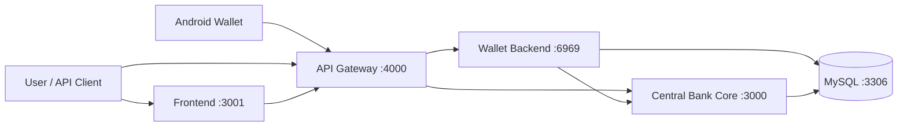

<div align="center">

# 🏦 SmartBank CBDC Integration

**Two-tier Central Bank Digital Currency (CBDC) simulation platform untuk pengujian integrasi end-to-end.**

[](./LICENSE)
[](https://nodejs.org)
[](https://www.typescriptlang.org)
[](https://nestjs.com)
[](https://nextjs.org)
[](https://www.prisma.io)
[](https://www.mysql.com)
[](https://www.docker.com)
[](./CONTRIBUTING.md)
[](https://prettier.io)

</div>

---

## 📑 Daftar Isi

- [🎯 Tentang Proyek](#-tentang-proyek)
- [✨ Highlights v2.0 — Fitur Baru](#-highlights-v20--fitur-baru)
- [🏗️ Arsitektur](#-arsitektur)
- [📚 Dokumentasi Service](#-dokumentasi-service)
- [🚀 Quick Start](#-quick-start)
- [Clone / Duplikasi Project dari GitHub](#clone--duplikasi-project-dari-github)
- [Menjalankan Android Wallet](#menjalankan-android-wallet)
- [📋 Prasyarat](#-prasyarat)
- [🔐 Akun Pengujian](#-akun-pengujian)
- [🎛️ Fitur Admin Bank Sentral](#-fitur-admin-bank-sentral)
  - [💸 Issuance (Cetak CBDC)](#-issuance-cetak-cbdc)
  - [🔥 Burn (Musnahkan CBDC)](#-burn-musnahkan-cbdc)
  - [⏪ Reversal (Balikkan Transaksi)](#-reversal-balikkan-transaksi)
  - [⚙️ Fee Configuration](#-fee-configuration)
  - [📜 Audit Log](#-audit-log)
  - [📊 Supply Monitor](#-supply-monitor)
  - [🔍 Ledger Browser](#-ledger-browser)
- [🧪 Testing Manual](#-testing-manual)
- [🔌 API Reference](#-api-reference)
- [💰 Aturan Finansial](#-aturan-finansial)
- [🛠️ Troubleshooting](#-troubleshooting)
- [📂 Struktur Direktori](#-struktur-direktori)
- [🤝 Kontribusi](#-kontribusi)
- [📄 Lisensi](#-lisensi)

---

## 🎯 Tentang Proyek

SmartBank adalah simulasi **two-tier Central Bank Digital Currency (CBDC)** yang
menggabungkan empat service独立 ke dalam satu platform terorkestrasi:

| Service       | Tech              | Port | Peran |
|---------------|-------------------|------|-------|
| **Frontend**  | Next.js 14        | 3001 | UI untuk semua role (Retail, Teller, Manager, Admin) |
| **API Gateway** | Express.js      | 4000 | Pintu masuk tunggal, routing, rate limit, validasi header |
| **Wallet Backend** | Express.js   | 6969 | Akun, transfer, payment request, loan |
| **Central Bank Core** | NestJS + Prisma | 3000 | Settlement engine, monetary policy, audit trail |
| **Android Wallet** | Kotlin + Jetpack Compose | Emulator / device | Client mobile untuk user retail |

> ⚠️ **Proyek ini ditujukan untuk simulasi akademis dan bukan sistem perbankan produksi.**

---

## ✨ Highlights v2.0 — Fitur Baru

Versi terbaru menambahkan **5 fitur admin bank sentral** lengkap dengan dashboard UI:

| # | Fitur | Endpoint | Dashboard | Tujuan Bisnis |
|---|-------|----------|-----------|---------------|
| 1 | 💸 **Issuance** | `POST /central-bank/issuance` | `/admin/issuance` | Cetak CBDC baru dari reserve |
| 2 | 🔥 **Burn** | `POST /central-bank/burn` | `/admin/burn` | Musnahkan CBDC → sink account |
| 3 | ⏪ **Reversal** | `POST /central-bank/reversals` | `/admin/reversal` | Batalkan transaksi SETTLED |
| 4 | ⚙️ **Fee Config** | `GET/PUT /central-bank/fees` | `/admin/fee` | Atur fee FLAT/PERCENT per jenis transaksi |
| 5 | 📜 **Audit Log** | `GET /central-bank/audit-logs` | `/admin/audit` | Browse jejak audit seluruh sistem |

Plus: **Supply Monitor** dengan invariant check, **Ledger Browser** dengan filter, **Dashboard overhaul** dengan role-based sidebar.

Lihat [🎛️ Fitur Admin Bank Sentral](#-fitur-admin-bank-sentral) untuk detail lengkap.

---

## 🏗️ Arsitektur



Untuk pemakaian normal, frontend dan API client harus mengakses backend melalui
API Gateway. Port `3000` dan `6969` tetap diekspos untuk health check, debugging,
dan Swagger lokal.

### Tech Stack Detail

| Layer | Tools |
|-------|-------|
| **Frontend** | Next.js 14, React, TypeScript, Tailwind CSS, Framer Motion, Lucide Icons |
| **Android Wallet** | Kotlin, Jetpack Compose, Material 3, MVVM, Retrofit, OkHttp, Gson, DataStore |
| **API Gateway** | Express.js, Axios, Rate Limiting |
| **Wallet Backend** | Express.js, JWT, bcrypt, Multer, Swagger |
| **Central Bank** | NestJS, Prisma ORM, MySQL 8, class-validator |
| **Database** | MySQL 8 dengan Prisma migrations |
| **Container** | Docker Compose (multi-stage build) |

---

## 📚 Dokumentasi Service

Dokumentasi detail per service dan operational guide. README utama ini hanya high-level overview — lihat doc terkait untuk deep-dive.

| Doc | Isi | Untuk siapa |
|---|---|---|
| [`Central-Bank/README.md`](./Central-Bank/README.md) | Arsitektur, financial invariants, endpoint list, Prisma migration guide, schema, local setup | Backend developer / Prisma contributor |
| [`DOCKER_SETUP.md`](./DOCKER_SETUP.md) | Full Docker Compose deployment (5 service), env vars, Prisma di Docker, troubleshooting, production hardening | DevOps / deployer / hosting |
| [`dokumentasi-lokal.md`](./dokumentasi-lokal.md) | Setup tanpa Docker (Laragon + MySQL lokal Windows) | Frontend-only developer / akademik |
| [`AUDIT_REPORT.md`](./AUDIT_REPORT.md) | Audit keamanan & kualitas kode | Reviewer / auditor |
| [`PR.md`](./PR.md) | Ringkasan PR & changelog | Maintainer / kontributor |

### Per-Service

| Service | Tech | Port | Dokumentasi |
|---|---|---|---|
| **Central-Bank** | NestJS + Prisma | 3000 | [`Central-Bank/README.md`](./Central-Bank/README.md) + [`AGENTS.md`](./Central-Bank/AGENTS.md) |
| **Wallet** | Express + mysql2 | 6969 | Belum ada README — lihat source di [`Wallet/`](./Wallet/) (entrypoint: `server.js`) |
| **Gateway** | Express | 4000 | Belum ada README — lihat source di [`Gateway/`](./Gateway/) (entrypoint: `server.js`) |
| **Frontend** | Next.js 14 | 3001 | Belum ada README — lihat source di [`frontend/src/`](./frontend/src/) |
| **Android Wallet** | Kotlin + Jetpack Compose | Emulator / device | Source di [`android-wallet/`](./android-wallet/) |
| **MySQL** | mysql:8.0 | 3301 | Config via [`docker-compose.yml`](./docker-compose.yml) |

> **Tip:** Wallet/Gateway/Frontend belum punya README service-level. Kalau mau kontribusi, buat `README.md` di masing-masing folder mengikuti template Central-Bank/README.md (Architecture → Setup → API → Schema).

---

## 🚀 Quick Start

### Dengan Docker (direkomendasikan)

```powershell
git clone https://github.com/RPL2-Becode/SmartBank.git
cd SmartBank
cp .env.example .env   # atau buat manual
docker compose up -d --build --wait
```

Akses:

| Layanan | URL |
|---------|-----|
| Frontend | http://localhost:3001 |
| API Gateway | http://localhost:4000/health |
| Wallet Swagger | http://localhost:6969/api-docs |
| Central Bank Health | http://localhost:3000/api/v1/health |

### Tanpa Docker (Laragon + MySQL lokal)

Lihat [`dokumentasi-lokal.md`](./dokumentasi-lokal.md) untuk panduan lengkap.

---

## Clone / Duplikasi Project dari GitHub

Bagian ini dapat dipakai oleh anggota kelompok atau penguji lain yang ingin menyalin project dari GitHub lalu mencoba SmartBank di laptop masing-masing.

### 1. Clone repository

```powershell
git clone https://github.com/RPL2-Becode/SmartBank.git
cd SmartBank
```

Jika repository sudah di-fork ke akun sendiri, gunakan URL fork:

```powershell
git clone https://github.com/<username-kamu>/SmartBank.git
cd SmartBank
```

### 2. Buat file `.env`

Di Windows PowerShell:

```powershell
Copy-Item .env.example .env
```

Isi minimal `.env` untuk development lokal:

```dotenv
MYSQL_ROOT_PASSWORD=rootpassword
MYSQL_DATABASE=central_bank_core
MYSQL_USER=central_bank
MYSQL_PASSWORD=centralbankpass

JWT_SECRET=smartbank_local_development_secret_minimal_32_chars
JWT_ISSUER=smartbank
JWT_AUDIENCE=smartbank-clients

ENABLE_STAFF_SEED=true
NEXT_PUBLIC_API_BASE_URL=http://localhost:4000
```

File `.env` tidak di-commit karena berisi konfigurasi lokal/rahasia. Setiap laptop yang melakukan clone perlu membuat `.env` sendiri dari `.env.example`.

### 3. Jalankan backend SmartBank

```powershell
docker compose up -d --build
```

Cek status container:

```powershell
docker compose ps
```

Pastikan service berikut berjalan:

| Service | URL lokal |
|---|---|
| API Gateway | http://localhost:4000/health |
| Wallet Backend | http://localhost:6969 |
| Central Bank | http://localhost:3000/api/v1/health |
| Frontend Web | http://localhost:3001 |
| MySQL host port | localhost:3301 |

### 4. Stop backend

```powershell
docker compose down
```

Jika ingin reset database dan menghapus volume:

```powershell
docker compose down -v
```

Gunakan `down -v` hanya jika data testing memang boleh dihapus.

---

## Menjalankan Android Wallet

Project Android berada di folder:

```text
android-wallet/
```

Android Wallet adalah client mobile. Saldo, ledger, transaksi, fee, audit, loan, dan settlement tetap berasal dari Central-Bank melalui jalur:

```text
Android Wallet -> API Gateway :4000 -> Wallet Backend :6969 -> Central-Bank :3000 -> MySQL
```

### Prasyarat Android

- Android Studio terbaru
- Emulator Android atau device fisik
- Backend SmartBank sudah berjalan dengan `docker compose up -d --build`

### Cara membuka di Android Studio

1. Buka Android Studio.
2. Pilih **Open**.
3. Pilih folder `android-wallet` di dalam hasil clone.
4. Tunggu **Gradle Sync** selesai.
5. Pilih emulator, misalnya **Medium Phone**.
6. Pilih run configuration **app**.
7. Klik tombol **Run**.

Android Studio akan membuat file `android-wallet/local.properties` secara otomatis sesuai lokasi Android SDK di laptop masing-masing. File ini sengaja di-ignore oleh Git dan tidak perlu dikirim ke repository.

Contoh path pada mesin lokal:

```text
D:\Projects\SmartBank\android-wallet
```

### Base URL Android Emulator

Android emulator tidak memakai `localhost` untuk mengakses host Windows. Karena itu Android Wallet memakai:

```text
http://10.0.2.2:4000/
```

Konfigurasi ada di:

```text
android-wallet/app/build.gradle.kts
```

```kotlin
buildConfigField("String", "SMARTBANK_BASE_URL", "\"http://10.0.2.2:4000/\"")
```

### Fitur Android Wallet saat ini

- Splash screen Smart Bank
- Login dan register
- Dashboard saldo
- Sembunyikan/tampilkan saldo dengan ikon mata
- Mutasi transaksi
- Kirim dana
- Payment request
- Top up simulasi
- Inbox
- Akun/Profile
- Edit profil
- Ubah PIN
- Ubah password
- Pusat bantuan/chat banking
- Logout

### Build dari terminal

```powershell
cd android-wallet
.\gradlew.bat :app:assembleDebug
```

APK debug berada di:

```text
android-wallet/app/build/outputs/apk/debug/app-debug.apk
```

Install ke emulator/device:

```powershell
.\gradlew.bat :app:installDebug
```

### Troubleshooting Android

| Masalah | Solusi |
|---|---|
| `Token tidak valid` saat app baru dibuka | Logout/login ulang, atau uninstall app dari emulator agar DataStore token lama terhapus |
| Tidak bisa login/register | Pastikan backend aktif dan `http://localhost:4000/health` berhasil |
| Android tidak bisa akses backend | Pastikan base URL emulator `http://10.0.2.2:4000/`, bukan `localhost` |
| Gradle error unresolved reference padahal build terminal sukses | Android Studio: **File > Sync Project with Gradle Files**, lalu **Invalidate Caches and Restart** |
| Docker container name conflict | Jalankan `docker compose down`, atau hapus container lama dengan `docker rm -f <nama-container>` |

---

## 📋 Prasyarat

- **Docker Desktop** dengan Docker Compose (untuk full stack)
- **PowerShell** untuk menjalankan contoh API pada README ini
- **Node.js 20.x+** dan **pnpm 9.x** (untuk development tanpa Docker)
- **MySQL 8.x** (untuk development tanpa Docker)
- Port `3000`, `3001`, `3301`, `4000`, `6969` tidak sedang dipakai

### Environment Variables

Pastikan file `.env` tersedia di root proyek:

```dotenv
# MySQL
MYSQL_ROOT_PASSWORD=ganti_dengan_password_root
MYSQL_DATABASE=central_bank_core
MYSQL_USER=central_bank
MYSQL_PASSWORD=ganti_dengan_password_database

# Auth
JWT_SECRET=ganti_dengan_secret_acak_minimal_32_karakter

# Seeding
ENABLE_STAFF_SEED=true

# Frontend
NEXT_PUBLIC_API_BASE_URL=http://localhost:4000
```

> 🔒 **Jangan commit file `.env` yang berisi kredensial asli.**

---

## 🔐 Akun Pengujian

Jika `ENABLE_STAFF_SEED=true`, Wallet membuat akun staf berikut saat startup:

| Role | Email | Password | PIN |
|------|-------|----------|-----|
| Teller | `teller@test.com` | `password` | `123456` |
| Manager | `manager@test.com` | `password` | `123456` |
| Central Bank Admin | `admin@test.com` | `password` | `123456` |

Akun Retail dibuat melalui halaman Register (`/register`). Registrasi publik
selalu membuat role `WALLET_USER` dan memberikan saldo awal `Rp 50.000`.

### Route Pintas Setelah Login

| Role | Routes |
|------|--------|
| Retail | `/dashboard`, `/transfer`, `/kyc`, `/pinjaman`, `/aktivitas` |
| Teller | `/teller/nasabah`, `/teller/operasi` |
| Manager | `/manager/risiko`, `/manager/pinjaman` |
| **Central Bank Admin** | `/admin`, `/admin/ledger`, `/admin/reversal`, `/admin/issuance`, `/admin/burn`, `/admin/fee`, `/admin/audit` |

---

## 🎛️ Fitur Admin Bank Sentral

Semua fitur di bawah ini hanya dapat diakses oleh role **CENTRAL_BANK_ADMIN**
melalui sidebar `/admin/*`. Setiap aksi akan otomatis teraudit di tabel
`audit_logs` dan tercatat di tabel `monetary_policy_events`.

### 💸 Issuance (Cetak CBDC)

**Apa gunanya?** Menambah uang digital ke wallet tujuan dari reserve bank sentral.
Total supply bertambah. Tercatat sebagai `MonetaryPolicyEvent` dengan `eventType = ISSUANCE`.

**Cara Pakai:**

1. Buka `/admin/issuance`
2. Pilih **wallet target** dari dropdown WalletPicker
3. Isi **nominal** dalam IDR (integer)
4. Isi **reason code** (default: `MONETARY_EXPANSION`)
5. (Opsional) Tambah catatan
6. Klik **"Proses issuance"**

**Validasi:**

- Nominal harus angka positif
- Wallet target harus ada dan aktif
- Reserve harus memiliki saldo cukup

**Apa yang terjadi di backend:**

```text
CENTRAL_RESERVE  → DEBIT (uang keluar dari reserve)
target_wallet    → CREDIT (uang masuk ke wallet tujuan)
```

**Contoh kasus:** Stimulus ekonomi, hibah pemerintah ke wallet tertentu,
top-up darurat ke merchant.

---

### 🔥 Burn (Musnahkan CBDC)

**Apa gunanya?** Menarik uang digital dari wallet USER/MERCHANT dan masuk ke
`BURN_OR_SINK_ACCOUNT`. Total supply berkurang. Tercatat sebagai
`MonetaryPolicyEvent` dengan `eventType = BURN`.

**Cara Pakai:**

1. Buka `/admin/burn`
2. Pilih **wallet sumber** dari WalletPicker
3. Isi **nominal**
4. **Reason code** default: `MONETARY_CONTRACTION`
5. Submit

**Validasi:**

- Hanya wallet `USER_WALLET` atau `MERCHANT_WALLET` yang bisa di-burn
- Akun sistem (reserve, fee, sink, dll) akan ditolak dengan `BURN_ACCOUNT_INVALID`
- Wallet sumber harus memiliki saldo cukup

**Contoh kasus:** Sanksi wallet fraud, tarik uang dari merchant nakal,
kontraksi moneter.

---

### ⏪ Reversal (Balikkan Transaksi)

**Apa gunanya?** Membatalkan transaksi yang sudah `SETTLED`. Semua entry
ledger dibalik (DEBIT ↔ CREDIT). Tercatat sebagai transaksi baru dengan
`transactionType = REVERSAL` yang menunjuk ke transaksi asal.

**Cara Pakai:**

1. Buka `/admin/reversal`
2. Pilih **transaksi asal** dari TransactionPicker
3. **Reason code** default: `ADMIN_CORRECTION` (wajib diisi)
4. (Opsional) Catatan
5. Submit

**Validasi:**

- Hanya transaksi `SETTLED` yang bisa di-reverse
- Transaksi yang **sudah pernah di-reverse** → ditolak `REVERSAL_NOT_ALLOWED`
- Type yang bisa di-reverse: TOP_UP, WITHDRAWAL, TRANSFER, PAYMENT, LOAN_DISBURSEMENT, LOAN_REPAYMENT, INITIAL_DISTRIBUTION, ISSUANCE, BURN

**Apa yang terjadi:**

- Entry ledger lama dibalik
- Transaksi baru `REVERSAL` dibuat, `originalTransactionId` menunjuk ke asal
- Transaksi asal di-update jadi `REVERSED`
- Audit log: `TRANSACTION_REVERSED`

**Contoh kasus:** Salah nominal transfer, fraud terdeteksi, koreksi kesalahan admin.

---

### ⚙️ Fee Configuration

**Apa gunanya?** Admin bisa mengatur biaya transaksi per jenis transaksi,
dengan mode **FLAT** (nominal tetap IDR) atau **PERCENT** (basis points, 100 bps = 1%).

**Cara Pakai:**

1. Buka `/admin/fee`
2. Lihat **tabel fee aktif** di atas
3. Di **form upsert**:
   - Pilih **jenis transaksi** (TOP_UP / WITHDRAWAL / TRANSFER / PAYMENT)
   - Pilih **mode**: FLAT (IDR) atau PERCENT (bps)
   - Isi **value** — nominal atau basis points
   - Untuk PERCENT → bisa set **min fee** dan **max fee** opsional
   - Centang **aktif**
4. Klik **"Simpan fee"**
5. Untuk edit → klik tombol **Edit** di tabel, form auto-fill

**Contoh Setting:**

| Jenis | Mode | Value | Min/Max | Arti |
|-------|------|-------|---------|------|
| TRANSFER | FLAT | 5000 | — | Tiap transfer kena fee Rp 5.000 |
| PAYMENT | PERCENT | 250 | min 1000, max 50000 | Fee 2.5%, min Rp 1.000, max Rp 50.000 |
| TOP_UP | FLAT | 0 | — | Gratis top-up |
| WITHDRAWAL | PERCENT | 100 | — | Fee 1% withdrawal |

**Validasi:**

- Value tidak boleh negatif
- PERCENT max 10000 bps (100%)
- Type harus valid (TOP_UP/WITHDRAWAL/TRANSFER/PAYMENT)

---

### 📜 Audit Log

**Apa gunanya?** Browser **semua jejak audit** seluruh sistem — siapa
ngapain, kapan, target apa. Penting untuk compliance & forensik.

**Cara Pakai:**

1. Buka `/admin/audit`
2. **Search box** → cari di actor, action, target, request ID
3. **Service dropdown** → filter CENTRAL-BANK, SETTLEMENT, MONEY, FEES, dll
4. **Klik baris mana saja** → expand untuk lihat metadata JSON lengkap

**Informasi per baris:**

| Kolom | Keterangan |
|-------|------------|
| Waktu | Kapan terjadi |
| Aktor | Siapa (UUID user / "system") |
| Service | Layanan mana (centralbank-core, dll) |
| Aksi | Apa yang terjadi (TRANSFER_SETTLED, ISSUANCE_SETTLED, dll) |
| Target | Tipe + ID (transaction/loan/wallet) |
| Reason | Reason code jika ada |
| Expand | Request ID, Actor full, Target ID, Metadata JSON |

---

### 📊 Supply Monitor

**Apa gunanya?** Pantauan supply uang digital secara real-time dengan
**invariant check** untuk mendeteksi anomali.

**Cara Pakai:** Buka `/admin` (default landing untuk admin).

**Yang ditampilkan:**

- **Total supply** — nilai target (default Rp 1 Miliar)
- **Reserve balance** — saldo di `CENTRAL_RESERVE`
- **Circulating supply** — total saldo wallet user/merchant aktif
- **Sink/burn accounting** — saldo di `BURN_OR_SINK_ACCOUNT`
- **Invariant ledger** — badge VALID / PERLU INVESTIGASI

**Invariant:** `reserve + circulating + sink === totalSupply`

---

### 🔍 Ledger Browser

**Apa gunanya?** Penelusuran ledger entries untuk audit atau debugging.

**Cara Pakai:**

1. Buka `/admin/ledger`
2. Filter by **account ID** atau **transaction ID** (opsional)
3. Klik **Cari**

---

## 🧪 Testing Manual

### 1. Verifikasi Stack

1. `docker compose ps` — semua service harus `Up` dan `healthy`
2. Buka http://localhost:4000/health — respons `success: true`
3. Buka http://localhost:3001 — frontend dapat diakses

### 2. Registrasi Dua Pengguna Retail

1. Buka `http://localhost:3001/register`
2. Isi nama, email, nomor telepon, password ≥ 8 karakter, PIN 6 digit
3. Daftarkan User A, catat email & PIN-nya
4. Logout, ulangi untuk User B
5. Setelah registrasi, saldo awal harus `Rp 50.000`
6. Upload dokumen KYC di menu `Verifikasi KYC` atau `/kyc`
7. Status tetap `BASIC` sampai Teller verifikasi

### 3. Testing Teller

1. Login `teller@test.com` / `password`
2. Cari User A via email/telepon/User ID
3. Periksa dokumen identitas
4. Isi reason code, klik verifikasi KYC → status jadi `VERIFIED`
5. Lakukan top-up (misal 100000)
6. Lakukan withdraw (misal 10000)
7. Cari User B, catat Wallet ID-nya

### 4. Testing Transfer Retail

1. Login sebagai User A
2. Buka menu `Transfer`, masukkan Wallet ID User B
3. Isi nominal, catatan, PIN User A
4. Klik `Kirim dana`
5. Pastikan sukses dan transaksi baru tampil di Aktivitas
6. Login sebagai User B, pastikan saldo & riwayat bertambah

### 5. Testing Pinjaman

1. User A ajukan pinjaman (misal 10000)
2. Login `manager@test.com`, buka `/manager/pinjaman`
3. Approve atau reject dengan reason code
4. Jika disetujui, User A saldo bertambah
5. Pembayaran lewat `/pinjaman`

### 6. Testing Admin Bank Sentral

1. Login `admin@test.com`
2. Buka `/admin` → lihat supply & invariant
3. Buka `/admin/issuance` → cetak CBDC ke wallet User A
4. Buka `/admin/burn` → musnahkan sebagian dari User B
5. Buka `/admin/reversal` → reverse transaksi issuance tadi
6. Buka `/admin/fee` → set fee TRANSFER 1%
7. Buka `/admin/audit` → browse semua aksi yang baru dilakukan

### Hasil Minimum yang Diharapkan

- ✅ Semua halaman utama terbuka tanpa error `502`
- ✅ Registrasi menghasilkan akun Retail dengan saldo awal
- ✅ Nasabah dapat upload KYC, Teller verifikasi
- ✅ Nasabah `BASIC` tidak bisa ajukan pinjaman, max saldo Rp 100.000
- ✅ Teller bisa top-up, withdraw, verifikasi KYC
- ✅ Transfer kurangi saldo pengirim, tambah saldo penerima
- ✅ Loan approval cairkan dana, reject tidak
- ✅ Suspend blokir login, activate pulihkan
- ✅ Admin bisa issuance, burn, reversal, set fee, browse audit log
- ✅ Supply invariant selalu VALID

---

## 🔌 API Reference

### Base URL

| API | Base URL melalui Gateway |
|-----|--------------------------|
| Wallet | `http://localhost:4000/api/wallet/v1` |
| Central Bank | `http://localhost:4000/api/bank` |

Gateway menghapus prefix tersebut sebelum meneruskan ke service tujuan.

### Header Standar

| Header | Kapan digunakan |
|--------|-----------------|
| `Authorization: Bearer <token>` | Semua endpoint protected |
| `Content-Type: application/json` | Request dengan JSON body |
| `Idempotency-Key: <uuid>` | Operasi finansial & mutasi penting (otomatis di-generate frontend) |
| `X-Wallet-Pin: <6 digit>` | Transfer, top-up, withdraw, payment request |
| `X-Request-Id: <uuid>` | Opsional untuk pelacakan log |

### Format Respons

```json
{
  "success": true,
  "data": {},
  "error": null,
  "meta": {
    "request_id": "req_example",
    "timestamp": "2026-06-11T00:00:00.000Z"
  }
}
```

Error:

```json
{
  "success": false,
  "data": null,
  "error": {
    "code": "BAD_REQUEST",
    "message": "Data tidak valid",
    "details": {}
  },
  "meta": {
    "request_id": "req_example",
    "timestamp": "2026-06-11T00:00:00.000Z"
  }
}
```

> Gateway membatasi ~100 request per menit per client.

### Endpoint Wallet

| Method | Path | Akses | Body/Parameter |
|--------|------|-------|----------------|
| `POST` | `/auth/register` | Public | `name`, `email`, `phone`, `password`, `pin` |
| `POST` | `/auth/login` | Public | `email`, `password` |
| `GET` | `/wallets/me/balance` | JWT | — |
| `GET` | `/wallets/me/transactions` | JWT | — |
| `PUT` | `/wallets/me/kyc-document` | JWT | `documentType`, `documentNumber`, `documentName`, `documentDataUrl` |
| `POST` | `/wallets/me/topup` | JWT + PIN | `amount` |
| `POST` | `/wallets/me/withdraw` | JWT + PIN | `amount` |
| `POST` | `/transfers` | JWT + PIN + Idempotency | `to_wallet_id`, `amount`, opsional `note` |
| `POST` | `/loans/apply` | JWT + Idempotency | `amount` |
| `POST` | `/loans/:id/repay` | JWT + Idempotency | `amount` |

### Endpoint Central Bank

| Method | Path | Role | Body/Query |
|--------|------|------|------------|
| `POST` | `/auth/register` | Public | `name`, `email`, `password` |
| `POST` | `/auth/login` | Public | `email`, `password` |
| `GET` | `/health` | JWT via Gateway | — |
| `POST` | `/fees/quote` | JWT via Gateway | `source_app`, `amount` |
| `POST` | `/transfers` | Wallet User + Idempotency | `to_wallet_id`, `amount`, `note` |
| `POST` | `/payment-requests` | Wallet User + Idempotency | payer, payee, gross_amount, expires_at |
| `POST` | `/payment-requests/:id/pay` | Wallet User + Idempotency | path `id` |
| `POST` | `/loans/apply` | Wallet User + Idempotency | `amount` |
| `POST` | `/loans/:id/repay` | Wallet User + Idempotency | `amount` |
| `GET` | `/teller/customer?query=...` | Teller/Manager | email/phone/userId |
| `POST` | `/teller/kyc/verify` | Teller/Manager | `userId`, `reasonCode` |
| `POST` | `/teller/top-up` | Teller/Manager + Idempotency | `userId`, `amount`, `reasonCode` |
| `POST` | `/teller/withdraw` | Teller/Manager + Idempotency | `userId`, `amount`, `reasonCode` |
| `POST` | `/manager/users/suspend` | Manager | `userId`, `reasonCode` |
| `POST` | `/manager/users/activate` | Manager | `userId`, `reasonCode` |
| `GET` | `/manager/loans/pending` | Manager | — |
| `POST` | `/manager/loans/approve` | Manager + Idempotency | `loanId`, `reasonCode` |
| `POST` | `/manager/loans/reject` | Manager + Idempotency | `loanId`, `reasonCode` |
| **🆕** `GET` | `/central-bank/supply` | **Admin** | — |
| **🆕** `GET` | `/central-bank/ledger` | **Admin** | `account_id`, `transaction_id`, `from`, `to` |
| **🆕** `GET` | `/central-bank/wallets` | **Admin** | `account_type`, `search` |
| **🆕** `GET` | `/central-bank/transactions` | **Admin** | `limit` |
| **🆕** `POST` | `/central-bank/issuance` | **Admin + Idempotency** | `target_wallet_id`, `amount`, `reason_code`, `note` |
| **🆕** `POST` | `/central-bank/burn` | **Admin + Idempotency** | `source_wallet_id`, `amount`, `reason_code`, `note` |
| **🆕** `POST` | `/central-bank/reversals` | **Admin + Idempotency** | `original_transaction_id`, `reason_code`, `note` |
| **🆕** `GET` | `/central-bank/fees` | **Admin** | — |
| **🆕** `GET` | `/central-bank/fees/:type` | **Admin** | path `type` |
| **🆕** `PUT` | `/central-bank/fees` | **Admin** | `type`, `mode`, `value`, `min_fee`, `max_fee`, `is_active` |
| **🆕** `GET` | `/central-bank/audit-logs` | **Admin** | `search`, `service_name`, `limit` |

### Testing API dengan PowerShell

```powershell
$baseUrl = "http://localhost:4000"

# Login admin
$login = Invoke-RestMethod `
  -Method Post `
  -Uri "$baseUrl/api/bank/auth/login" `
  -ContentType "application/json" `
  -Body (@{ email = "admin@test.com"; password = "password" } | ConvertTo-Json)

$token = $login.data.accessToken
$authHeaders = @{ Authorization = "Bearer $token"; "Idempotency-Key" = ([guid]::NewGuid()) }

# Cek supply
Invoke-RestMethod -Uri "$baseUrl/api/bank/central-bank/supply" -Headers $authHeaders

# Issuance 100000 ke wallet
$issuanceBody = @{
  target_wallet_id = "wal_user_id"
  amount = "100000"
  reason_code = "MANUAL_TEST"
} | ConvertTo-Json

Invoke-RestMethod `
  -Method Post `
  -Uri "$baseUrl/api/bank/central-bank/issuance" `
  -Headers $authHeaders `
  -ContentType "application/json" `
  -Body $issuanceBody
```

---

## 💰 Aturan Finansial

| Parameter | Default | Keterangan |
|-----------|---------|------------|
| Saldo awal user | `Rp 50.000` | Dikreditkan saat registrasi |
| Limit saldo BASIC | `Rp 100.000` | Nasabah KYC `BASIC` dibatasi |
| Total money supply | `Rp 1.000.000.000` | Hardcoded di `TOTAL_MONEY_SUPPLY` |
| Maksimum pinjaman | `Rp 100.000` | Default |
| Bunga pinjaman | 10% (flat) | |
| Limit transaksi harian | 10 transaksi | Default, env-configurable |
| Cooldown transaksi | 10 detik | Default, env-configurable |
| Fee default | 0 (FLAT) | Dikonfigurasi via `/admin/fee` |

Nilai aktual dapat diubah melalui environment variable pada `docker-compose.yml`.

---

## 🛠️ Troubleshooting

### Container tidak healthy

```powershell
docker compose ps
docker compose logs --tail 200 mysql
docker compose logs --tail 200 central-bank
docker compose logs --tail 200 wallet
docker compose logs --tail 200 gateway
docker compose logs --tail 200 frontend
```

### Frontend menampilkan 502

1. Pastikan Gateway, Wallet, dan Central Bank berstatus healthy
2. Periksa `NEXT_PUBLIC_API_BASE_URL=http://localhost:4000`
3. Rebuild frontend:
   ```powershell
   docker compose up -d --build --wait frontend
   ```

### Login staf gagal

1. Pastikan `.env` berisi `ENABLE_STAFF_SEED=true`
2. Restart Wallet: `docker compose restart wallet`

### Error cooldown atau daily limit

Tunggu minimal 10 detik sebelum transaksi berikutnya. Jika batas harian tercapai,
gunakan akun uji lain atau reset volume database.

### Migration drift / db push warning

```powershell
cd Central-Bank
npx prisma db push     # sinkron schema tanpa migration file
```

### Port sudah digunakan

```powershell
docker ps
Get-NetTCPConnection -State Listen | Where-Object LocalPort -In 3000,3001,3306,4000,6969
```

---

## 📂 Struktur Direktori

```text
SmartBank/
├── Central-Bank/          # NestJS Central Bank Core
│   ├── prisma/
│   │   ├── schema.prisma  # Database schema (Fee, Audit, MonetaryEvent)
│   │   └── migrations/    # SQL migration files
│   ├── src/
│   │   ├── common/        # AppError, ErrorCode, decorators
│   │   ├── modules/
│   │   │   ├── central-bank/  # Controller, DTO, MonetaryPolicyService
│   │   │   ├── settlement/    # SettlementService (issuance, burn, reversal)
│   │   │   ├── fees/          # FeeQuoteService
│   │   │   ├── audit/         # AuditLogService
│   │   │   └── prisma/        # PrismaService
│   │   └── main.ts
│   └── test/              # Jest unit + integration tests
├── Wallet/                # Express Wallet Backend
│   ├── src/
│   │   ├── routes/        # auth, wallet, transfer, loan
│   │   └── swagger/       # OpenAPI docs
│   └── Dockerfile
├── Gateway/               # Express API Gateway
│   ├── src/
│   │   ├── routes/        # /api/wallet, /api/bank
│   │   └── middleware/    # rate limit, auth
│   └── Dockerfile
├── frontend/              # Next.js role-based frontend
│   ├── src/
│   │   ├── app/
│   │   │   └── admin/     # Admin dashboards (supply, ledger, issuance, burn, fee, audit)
│   │   ├── components/
│   │   │   ├── dashboards/  # Admin*.tsx components
│   │   │   └── admin/       # WalletPicker, TransactionPicker
│   │   └── lib/             # fetchApi, auth store
│   └── Dockerfile
├── docker-compose.yml     # Orkestrasi seluruh service
├── .env.example           # Template environment variables
├── README.md              # Dokumentasi ini
├── LICENSE                # MIT License
├── CODE_OF_CONDUCT.md     # Contributor Covenant v2.1
└── CONTRIBUTING.md        # Panduan kontribusi
```

---

## 🤝 Kontribusi

Kontribusi selalu diterima! Lihat [CONTRIBUTING.md](./CONTRIBUTING.md) untuk
panduan lengkap tentang:

- 🐛 Lapor bug atau request fitur
- 🔀 Cara membuat Pull Request
- 🏗️ Setup development environment
- 📏 Konvensi kode & commit message
- ✅ Pull request checklist

Proyek ini mengikuti [Contributor Covenant Code of Conduct](./CODE_OF_CONDUCT.md).

### Quick Start untuk Kontributor

```bash
git clone https://github.com/RPL2-Becode/SmartBank.git
cd SmartBank
git checkout -b feat/nama-fitur-anda
# ... lakukan perubahan ...
git commit -m "feat(scope): deskripsi perubahan"
git push origin feat/nama-fitur-anda
# buka Pull Request via GitHub
```

---

## 📄 Lisensi

Didistribusikan di bawah **MIT License**. Lihat [`LICENSE`](./LICENSE) untuk detail.

```
MIT License - Copyright (c) 2026 RPL2-Becode
```

---

## 🙏 Acknowledgments

- Built with ❤️ by RPL2-Becode
- Powered by [NestJS](https://nestjs.com), [Next.js](https://nextjs.org), [Prisma](https://www.prisma.io), and [MySQL](https://www.mysql.com)
- Icons by [Lucide](https://lucide.dev)
- Mermaid diagrams by [Mermaid](https://mermaid.js.org)

---

<div align="center">

**[⬆ Kembali ke atas](#-smartbank-cbdc-integration)**

Made with TypeScript, NestJS, Next.js, Prisma & MySQL

</div>
