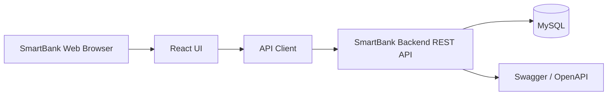
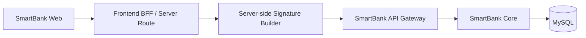
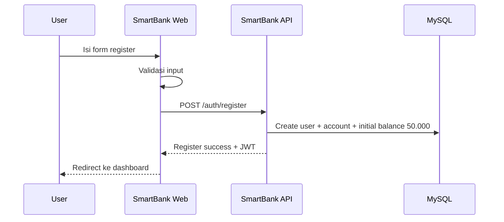
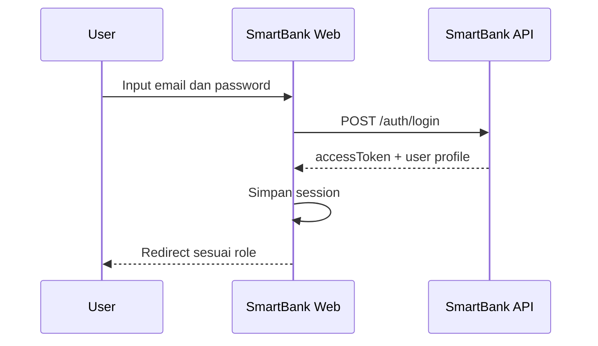
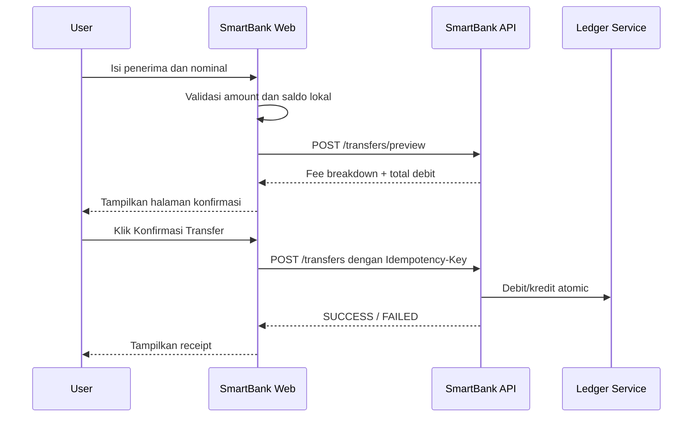
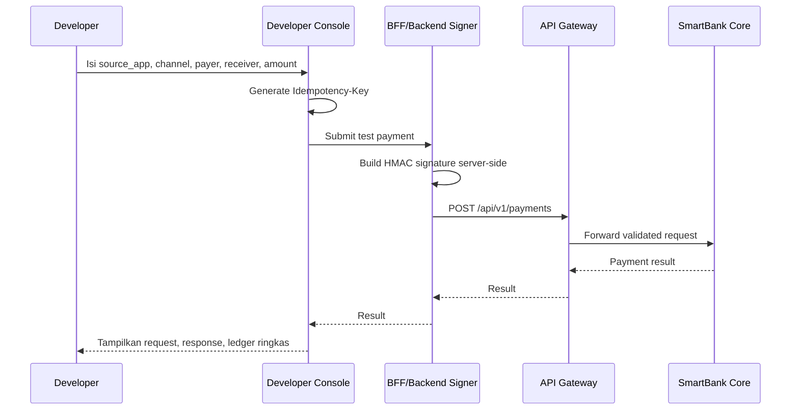
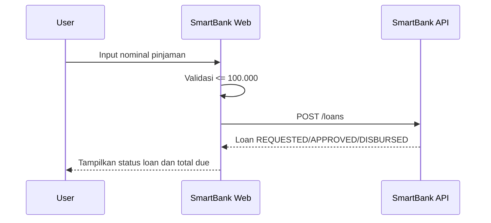
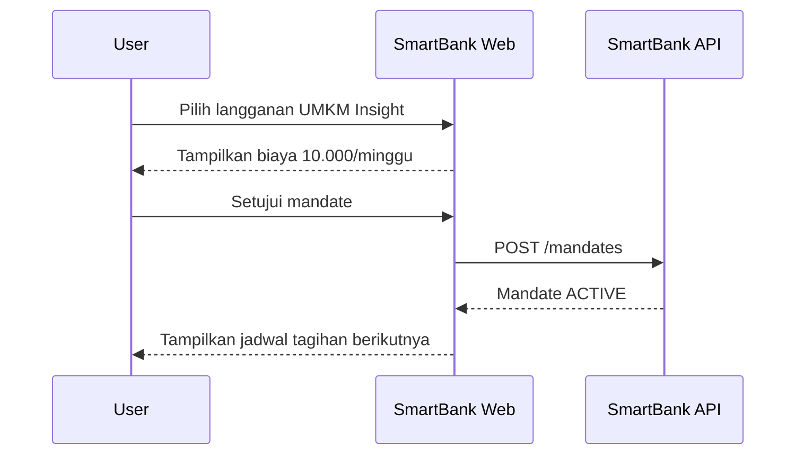
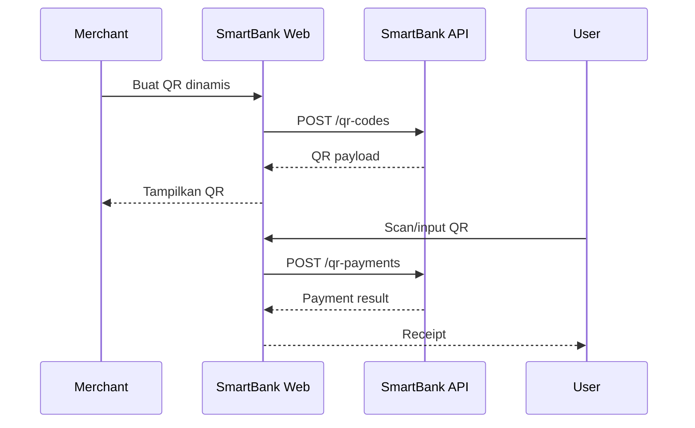

# Implementation Plan Frontend SmartBank Web

**Versi:** 1.0  
**Tanggal:** 2026-05-03  
**Dokumen terkait:** `implementation_plan.md`  
**Target aplikasi:** SmartBank Payment Gateway Web Portal  
**Backend target:** REST API `/api/v1`  
**Database backend:** MySQL 8.x / InnoDB  
**Dokumentasi API backend:** Swagger / OpenAPI 3.x  
**Arsitektur frontend MVP:** React/Next.js atau React Vite dengan TypeScript  
**Konteks:** Ekosistem RPL SmartBank, API Gateway/Integrator, Marketplace/PasarKita, POS/WarungPOS, SupplierHub, LogistiKita, dan UMKM Insight

---

## 1. Ringkasan Eksekutif

Frontend SmartBank Web adalah antarmuka utama untuk mengoperasikan dan memantau SmartBank Payment Gateway. Web ini tidak menggantikan backend SmartBank, tetapi menjadi lapisan presentasi untuk:

1. User melihat saldo, riwayat transaksi, transfer, pinjaman, subscription, dan bukti pembayaran.
2. Merchant/UMKM melihat pemasukan, status pembayaran, QR payment, dan transaksi masuk.
3. Admin SmartBank memantau ledger, money supply, fee rules, aplikasi terdaftar, webhook, audit log, dan rekonsiliasi.
4. Developer/Integrator menguji payment request, melihat API client, webhook deliveries, dan dokumentasi Swagger.
5. UMKM Insight membaca data transaksi secara read-only untuk dashboard analitik.

Frontend harus mengikuti prinsip SmartBank: **tidak ada saldo yang berubah langsung dari frontend**. Semua perubahan saldo tetap terjadi melalui backend SmartBank dan tercatat pada ledger MySQL.

Dokumen ini merancang frontend dari awal berdasarkan percakapan sebelumnya, yaitu:

- SmartBank sebagai pusat kontrol transaksi.
- Semua transaksi aplikasi lain harus menjadi `payment request`.
- Semua komunikasi integrasi lewat API Gateway/Integrator.
- Database backend menggunakan MySQL.
- Dokumentasi API menggunakan Swagger/OpenAPI.
- Payment Gateway mengadaptasi pola modern: idempotency, webhook, HMAC signature, ISO-style payload, tokenisasi internal, auto-payment mandate, SmartQR, dan hash-chain ledger.

---

## 2. Tujuan Frontend

### 2.1 Tujuan Utama

Membangun web portal SmartBank yang:

- Mudah dipakai untuk simulasi transaksi RPL.
- Menampilkan saldo dan histori transaksi secara jelas.
- Menyediakan form transfer, pembayaran, pinjaman, subscription, dan SmartQR.
- Menampilkan breakdown fee sebelum user melakukan konfirmasi.
- Menampilkan status transaksi secara real-time atau semi-real-time.
- Menyediakan dashboard admin untuk audit dan monitoring.
- Terintegrasi dengan Swagger/OpenAPI backend.
- Aman dari sisi session, role-based access, dan data exposure.

### 2.2 Tujuan Akademik/RPL

Frontend harus membantu demonstrasi:

- Alur **Input → Proses → Output** setiap fitur.
- Hubungan antar node aplikasi dalam ekosistem.
- Semua transaksi menghasilkan payment request.
- SmartBank menjadi satu-satunya pihak yang mengubah saldo.
- Fee, pajak, dan ledger bisa dilihat transparan.
- Admin dapat membuktikan bahwa debit dan kredit ledger seimbang.

### 2.3 Non-Goal untuk MVP Frontend

Tidak wajib dikerjakan pada MVP:

- Integrasi kartu debit/kredit sungguhan.
- Koneksi QRIS produksi.
- mTLS/DPoP/JWE penuh di browser.
- Trading aset digital, stablecoin, atau DLT produksi.
- Realtime websocket penuh bila belum tersedia di backend.
- Mobile app native.

---

## 3. Prinsip Desain Frontend

### 3.1 Prinsip Produk

1. **User melihat uangnya dengan jelas.** Saldo, debit, kredit, fee, pajak, dan status transaksi harus mudah dipahami.
2. **Transaksi sensitif harus memakai konfirmasi.** Transfer, payment, loan, subscription, dan QR payment harus memiliki halaman konfirmasi.
3. **Setiap pembayaran menunjukkan fee breakdown.** User tidak boleh membayar tanpa mengetahui komponen biaya.
4. **Status transaksi harus transparan.** `PENDING`, `PROCESSING`, `SUCCESS`, `FAILED`, `REVERSED`, dan `CANCELED` harus ditampilkan konsisten.
5. **Admin melihat sistem sebagai ledger.** Dashboard admin lebih fokus pada audit, money supply, rekonsiliasi, dan risiko.
6. **Developer melihat sistem sebagai API.** Developer console menonjolkan request, response, idempotency, webhook, dan Swagger.

### 3.2 Prinsip Keamanan

1. Frontend **tidak boleh menyimpan client secret**.
2. Frontend **tidak boleh menghitung HMAC dengan secret produksi**.
3. Frontend hanya mengirim JWT user untuk endpoint user-facing.
4. HMAC signature untuk integrasi antar aplikasi dilakukan di backend, BFF, atau Gateway.
5. Token akses sebaiknya disimpan di memory; refresh token sebaiknya memakai `HttpOnly Secure Cookie`.
6. Semua halaman sensitif wajib memakai route guard.
7. Menu dan action disaring berdasarkan role.
8. Semua input divalidasi di frontend, tetapi validasi final tetap di backend.
9. Jangan menampilkan data sensitif berlebihan pada layar, log browser, atau error message.

### 3.3 Prinsip Implementasi

1. Gunakan TypeScript.
2. Gunakan OpenAPI/Swagger sebagai sumber kontrak API.
3. Gunakan generated API client bila memungkinkan.
4. Pisahkan `server state`, `form state`, `auth state`, dan `UI state`.
5. Semua nominal uang diformat konsisten sebagai `SMART_COIN`.
6. Semua error API dipetakan menjadi pesan UI yang ramah.
7. Setiap form transaksi harus bisa menangani loading, success, failed, duplicate request, cooldown, dan daily limit.
8. Frontend harus responsive untuk laptop, tablet, dan smartphone.

---

## 4. Persona dan Role

| Role | Deskripsi | Akses Utama |
|---|---|---|
| Guest | User belum login | Login, register, lihat landing page |
| User / Mahasiswa | Pemilik saldo SmartBank | Dashboard, saldo, transfer, pembayaran, pinjaman, riwayat |
| Merchant / UMKM | Seller atau penerima pembayaran | Dashboard merchant, incoming payment, SmartQR, transaction history |
| Supplier | Penerima pembayaran SupplierHub | Incoming payment, histori, detail order bahan |
| Admin SmartBank | Operator sistem bank | Ledger, fee rules, money supply, users, applications, audit log |
| Developer / Integrator | Pengelola integrasi aplikasi | API clients, webhook, test payment, Swagger docs |
| Analytics Viewer | UMKM Insight/read-only | Dashboard analitik, laporan transaksi, tanpa write action |

---

## 5. Ruang Lingkup Halaman MVP

### 5.1 Public Pages

| Page | Route | Tujuan |
|---|---|---|
| Landing Page | `/` | Penjelasan singkat SmartBank |
| Login | `/auth/login` | Login user/admin/developer |
| Register | `/auth/register` | Registrasi user baru |
| Unauthorized | `/403` | Akses ditolak |
| Not Found | `/404` | Halaman tidak ditemukan |

### 5.2 User Wallet Pages

| Page | Route | Tujuan |
|---|---|---|
| User Dashboard | `/dashboard` | Ringkasan saldo, transaksi terakhir, limit, cooldown |
| Balance | `/wallet/balance` | Detail saldo dan account code/token |
| Transactions | `/wallet/transactions` | Riwayat transaksi user |
| Transaction Detail | `/wallet/transactions/:transactionCode` | Bukti pembayaran dan ledger ringkas |
| Transfer | `/wallet/transfer` | Transfer antar user |
| Payment Request | `/payments/new` | Membuat payment manual/test |
| Payment Status | `/payments/:paymentCode` | Melihat status payment request |
| Loans | `/loans` | Daftar pinjaman |
| Apply Loan | `/loans/apply` | Pengajuan pinjaman |
| Subscription | `/subscriptions` | UMKM Insight subscription |
| SmartQR Pay | `/smartqr/pay` | Scan/input QR untuk membayar |

### 5.3 Merchant Pages

| Page | Route | Tujuan |
|---|---|---|
| Merchant Dashboard | `/merchant/dashboard` | Ringkasan pembayaran masuk |
| Incoming Payments | `/merchant/payments` | Daftar pembayaran dari pembeli |
| Create SmartQR | `/merchant/smartqr/create` | Generate QR statis/dinamis |
| SmartQR List | `/merchant/smartqr` | Kelola QR yang dibuat |
| Settlement History | `/merchant/settlements` | Riwayat settlement internal |
| Fee Summary | `/merchant/fees` | Ringkasan fee yang dipotong |

### 5.4 Admin SmartBank Pages

| Page | Route | Tujuan |
|---|---|---|
| Admin Dashboard | `/admin` | Monitoring transaksi, reserve, fee, pajak, risiko |
| Accounts | `/admin/accounts` | Melihat rekening user, system account, reserve |
| Ledger | `/admin/ledger` | Audit ledger debit/kredit |
| Payment Requests | `/admin/payments` | Monitoring semua payment request |
| Transactions | `/admin/transactions` | Monitoring transaksi |
| Fee Rules | `/admin/fee-rules` | Kelola fee Marketplace, POS, Supplier, Logistik, Bank, Gateway, Pajak |
| Money Supply | `/admin/money-supply` | Monitoring total supply, reserve, circulating money |
| Loans | `/admin/loans` | Approve/reject/monitor loan |
| Applications | `/admin/applications` | Kelola aplikasi client: Marketplace, POS, SupplierHub, LogistiKita, UMKM Insight |
| Webhook Deliveries | `/admin/webhooks` | Monitoring webhook status dan retry |
| Audit Logs | `/admin/audit-logs` | Log request dan aktivitas sensitif |
| Reconciliation | `/admin/reconciliation` | Cocokkan payment request, transaction, ledger, webhook |

### 5.5 Developer / Integrator Pages

| Page | Route | Tujuan |
|---|---|---|
| Developer Dashboard | `/developer` | Ringkasan integrasi |
| API Clients | `/developer/api-clients` | Daftar client ID dan status aplikasi |
| Test Payment | `/developer/test-payment` | Simulasi request payment |
| Idempotency Inspector | `/developer/idempotency` | Melihat idempotency records |
| Webhook Endpoints | `/developer/webhook-endpoints` | Daftar callback URL |
| Webhook Test | `/developer/webhook-test` | Simulasi payload webhook |
| API Documentation | `/developer/api-docs` | Link/iframe Swagger UI |

### 5.6 Analytics Read-Only Pages

| Page | Route | Tujuan |
|---|---|---|
| UMKM Insight Dashboard | `/analytics/dashboard` | Visualisasi data transaksi |
| Sales Analytics | `/analytics/sales` | Penjualan per periode/channel |
| Cashflow Analytics | `/analytics/cashflow` | Debit/kredit dan arus kas |
| Fee Analytics | `/analytics/fees` | Fee bank, gateway, pajak, aplikasi |
| Export Report | `/analytics/reports` | Export CSV/PDF bila tersedia |

---

## 6. Sitemap dan Navigasi

```mermaid
flowchart TD
    A[Landing Page] --> B[Login]
    A --> C[Register]

    B --> D[User Dashboard]
    B --> E[Merchant Dashboard]
    B --> F[Admin Dashboard]
    B --> G[Developer Dashboard]
    B --> H[Analytics Dashboard]

    D --> D1[Balance]
    D --> D2[Transactions]
    D --> D3[Transfer]
    D --> D4[Payments]
    D --> D5[Loans]
    D --> D6[Subscriptions]
    D --> D7[SmartQR Pay]

    E --> E1[Incoming Payments]
    E --> E2[Create SmartQR]
    E --> E3[Settlement History]
    E --> E4[Fee Summary]

    F --> F1[Ledger]
    F --> F2[Payment Requests]
    F --> F3[Fee Rules]
    F --> F4[Money Supply]
    F --> F5[Applications]
    F --> F6[Webhook Deliveries]
    F --> F7[Audit Logs]
    F --> F8[Reconciliation]

    G --> G1[API Clients]
    G --> G2[Test Payment]
    G --> G3[Idempotency Inspector]
    G --> G4[Webhook Test]
    G --> G5[Swagger Docs]

    H --> H1[Sales Analytics]
    H --> H2[Cashflow]
    H --> H3[Fee Analytics]
    H --> H4[Reports]
```



---

## 7. Rekomendasi Stack Frontend

### 7.1 Stack Utama

| Area | Rekomendasi |
|---|---|
| Framework | React + TypeScript |
| App framework | Next.js atau Vite React |
| Routing | Next Router atau React Router |
| Styling | Tailwind CSS atau CSS Modules |
| UI components | Komponen custom + library UI opsional |
| Form | React Hook Form atau pendekatan form sejenis |
| Validation | Zod/Yup atau validator setara |
| API client | Axios/fetch wrapper + generated types dari OpenAPI |
| Server state | TanStack Query/React Query atau service cache setara |
| Auth state | Context/Zustand/Redux Toolkit sesuai kompleksitas |
| Charting | Recharts/Chart.js atau library chart sejenis |
| Testing | Vitest/Jest, Testing Library, Playwright/Cypress |
| Linting | ESLint + Prettier |
| Package manager | npm/pnpm/yarn |
| Deployment | Vercel, Netlify, Docker NGINX, atau static hosting internal |

### 7.2 Pilihan Implementasi yang Disarankan untuk RPL

Untuk tugas RPL, pilihan paling realistis:

```text
React + Vite + TypeScript
Tailwind CSS
React Router
Axios
React Query
React Hook Form + Zod
Swagger/OpenAPI YAML sebagai referensi kontrak
```

Alasan:

- Setup cepat.
- Mudah dipahami tim.
- Tidak terlalu berat.
- Cocok untuk demo local dengan backend.
- Mudah di-deploy dengan Docker/NGINX.

### 7.3 Pilihan Implementasi yang Lebih Production-Oriented

```text
Next.js + TypeScript
App Router
BFF route handlers untuk request yang butuh signing
HttpOnly Cookie session
OpenAPI generated client
Role-based layouts
Server-side rendering untuk halaman tertentu
```

Alasan:

- Cocok untuk keamanan session yang lebih baik.
- Bisa membuat BFF untuk melindungi client secret.
- Lebih rapi untuk role dan layout besar.
- Lebih mudah menyiapkan route `/api/proxy` bila frontend tidak boleh langsung memanggil backend.

---

## 8. Arsitektur Frontend

### 8.1 Arsitektur Tanpa BFF untuk MVP Sederhana



Cocok untuk:

- Login/register.
- Cek saldo.
- Transfer user.
- Riwayat transaksi.
- Pinjaman.
- Dashboard admin.
- Read-only analytics.

Catatan: model ini tidak boleh meletakkan `client_secret` di browser.

### 8.2 Arsitektur Dengan BFF untuk Integrasi Aman



Cocok untuk:

- Developer test payment.
- Simulasi request antar aplikasi.
- Endpoint yang butuh `X-Signature`.
- Webhook test.
- Idempotency playground.
- Admin action sensitif.

### 8.3 Keputusan MVP

Untuk MVP RPL:

1. Endpoint user dan admin dipanggil langsung dari frontend memakai JWT.
2. Endpoint integrasi yang membutuhkan HMAC bisa disimulasikan melalui backend SmartBank atau BFF.
3. Jangan menyimpan `client_secret` di `.env` frontend dengan prefix publik.
4. Bila harus demo HMAC di browser, beri label `DEMO ONLY`, bukan pola produksi.

---

## 9. Integrasi dengan Swagger/OpenAPI

### 9.1 Sumber Kontrak

Backend menyediakan:

```text
http://localhost:3000/api-docs
http://localhost:3000/openapi.json
docs/openapi.yaml
```

Frontend memakai kontrak ini untuk:

- Mengetahui endpoint.
- Mengetahui schema request/response.
- Menyesuaikan validasi form.
- Membuat generated API types.
- Mengurangi mismatch antara frontend dan backend.

### 9.2 Strategi API Client

Struktur:

```text
src/
  api/
    generated/
      smartbank-api.ts
      smartbank-types.ts
    http.ts
    auth.api.ts
    accounts.api.ts
    payments.api.ts
    transfers.api.ts
    loans.api.ts
    ledger.api.ts
    admin.api.ts
    webhooks.api.ts
```

`http.ts` bertanggung jawab untuk:

- Base URL.
- Authorization header.
- Request ID.
- Error normalization.
- Refresh token handling bila tersedia.
- Logging minimal di development.

Contoh interface:

```ts
type ApiError = {
  statusCode: number;
  code: string;
  message: string;
  details?: unknown;
};

type ApiResponse<T> = {
  status: 'SUCCESS' | 'FAILED';
  data?: T;
  error?: ApiError;
};
```

### 9.3 Header API

Untuk user-facing request:

```http
Authorization: Bearer <jwt>
X-Request-Id: <uuid>
```

Untuk payment request yang diuji melalui developer console:

```http
Authorization: Bearer <jwt>
X-Client-Id: <client_id>
X-Timestamp: <iso_timestamp>
X-Signature: <generated_by_server_or_demo>
Idempotency-Key: <uuid>
X-Request-Id: <uuid>
```

Aturan penting:

```text
Frontend boleh membuat Idempotency-Key.
Frontend boleh membuat X-Request-Id.
Frontend boleh mengirim JWT.
Frontend tidak boleh menyimpan client_secret produksi.
Frontend tidak boleh membuat HMAC produksi di browser.
```

---

## 10. Struktur Folder Frontend

```text
smartbank-frontend/
  public/
    logo.svg
    icons/

  src/
    app/
      App.tsx
      routes.tsx
      providers.tsx

    api/
      http.ts
      auth.api.ts
      accounts.api.ts
      payments.api.ts
      transfers.api.ts
      loans.api.ts
      ledger.api.ts
      admin.api.ts
      webhooks.api.ts
      generated/

    assets/

    components/
      common/
        Button.tsx
        Input.tsx
        Select.tsx
        Modal.tsx
        ConfirmDialog.tsx
        Toast.tsx
        Badge.tsx
        EmptyState.tsx
        ErrorState.tsx
        LoadingState.tsx
      layout/
        AppShell.tsx
        Sidebar.tsx
        Topbar.tsx
        Breadcrumb.tsx
        PageHeader.tsx
      finance/
        BalanceCard.tsx
        MoneyText.tsx
        FeeBreakdown.tsx
        PaymentStatusBadge.tsx
        TransactionTable.tsx
        LedgerEntryTable.tsx
        ReceiptPanel.tsx
      gateway/
        IdempotencyKeyField.tsx
        SignaturePreview.tsx
        WebhookTimeline.tsx
        ApiRequestPreview.tsx
      charts/
        TransactionVolumeChart.tsx
        FeeRevenueChart.tsx
        MoneySupplyChart.tsx

    features/
      auth/
        LoginPage.tsx
        RegisterPage.tsx
        auth.store.ts
        auth.schema.ts
      dashboard/
        UserDashboardPage.tsx
        AdminDashboardPage.tsx
        MerchantDashboardPage.tsx
      wallet/
        BalancePage.tsx
        TransactionsPage.tsx
        TransactionDetailPage.tsx
      transfer/
        TransferPage.tsx
        transfer.schema.ts
      payments/
        NewPaymentPage.tsx
        PaymentDetailPage.tsx
        PaymentPreviewPanel.tsx
        payment.schema.ts
      loans/
        LoansPage.tsx
        ApplyLoanPage.tsx
      subscriptions/
        SubscriptionsPage.tsx
        MandateDetailPage.tsx
      smartqr/
        SmartQRPayPage.tsx
        SmartQRCreatePage.tsx
      admin/
        LedgerPage.tsx
        FeeRulesPage.tsx
        MoneySupplyPage.tsx
        ApplicationsPage.tsx
        WebhookDeliveriesPage.tsx
        AuditLogsPage.tsx
        ReconciliationPage.tsx
      developer/
        DeveloperDashboardPage.tsx
        ApiClientsPage.tsx
        TestPaymentPage.tsx
        IdempotencyInspectorPage.tsx
        WebhookTestPage.tsx
      analytics/
        AnalyticsDashboardPage.tsx
        SalesAnalyticsPage.tsx
        CashflowAnalyticsPage.tsx

    hooks/
      useAuth.ts
      useRoleGuard.ts
      useMoneyFormatter.ts
      useIdempotencyKey.ts
      useCooldownTimer.ts
      usePagination.ts

    lib/
      constants.ts
      money.ts
      date.ts
      errors.ts
      permissions.ts
      storage.ts
      validators.ts

    styles/
      globals.css

    types/
      auth.ts
      account.ts
      payment.ts
      transaction.ts
      ledger.ts
      role.ts

  docs/
    frontend_routes.md
    frontend_test_cases.md

  .env.example
  package.json
  README.md
```

---

## 11. Environment Variables

Contoh `.env.example`:

```env
VITE_APP_NAME=SmartBank Web
VITE_API_BASE_URL=http://localhost:3000/api/v1
VITE_SWAGGER_URL=http://localhost:3000/api-docs
VITE_ENABLE_DEMO_SIGNATURE=false
VITE_ENABLE_MOCK_API=false
```

Untuk Next.js:

```env
NEXT_PUBLIC_APP_NAME=SmartBank Web
NEXT_PUBLIC_API_BASE_URL=http://localhost:3000/api/v1
NEXT_PUBLIC_SWAGGER_URL=http://localhost:3000/api-docs

# Jangan prefix NEXT_PUBLIC untuk secret server-side
SMARTBANK_BFF_CLIENT_SECRET=change-me-server-only
```

Aturan:

- Variable dengan prefix `VITE_` atau `NEXT_PUBLIC_` akan terlihat oleh browser.
- Jangan pernah menyimpan `client_secret`, private key, atau signing secret sebagai public env.
- Secret hanya boleh berada di backend/BFF.

---

## 12. Desain Layout

### 12.1 App Shell

Komponen utama:

```text
AppShell
  ├── Sidebar
  ├── Topbar
  ├── Breadcrumb
  ├── PageHeader
  └── MainContent
```

Sidebar berubah berdasarkan role.

### 12.2 Sidebar User

```text
Dashboard
Saldo
Riwayat Transaksi
Transfer
Pembayaran
Pinjaman
Subscription
SmartQR
Profil
```

### 12.3 Sidebar Merchant

```text
Dashboard Merchant
Pembayaran Masuk
SmartQR
Settlement
Fee Summary
Profil Merchant
```

### 12.4 Sidebar Admin

```text
Admin Dashboard
Accounts
Ledger
Payment Requests
Transactions
Fee Rules
Money Supply
Loans
Applications
Webhook Deliveries
Audit Logs
Reconciliation
Swagger Docs
```

### 12.5 Sidebar Developer

```text
Developer Dashboard
API Clients
Test Payment
Idempotency
Webhook Endpoints
Webhook Test
Swagger Docs
```

---

## 13. Design System

### 13.1 Komponen Dasar

| Komponen | Fungsi |
|---|---|
| `Button` | Primary, secondary, danger, ghost |
| `Input` | Text, number, password, currency |
| `Select` | Pilihan channel, role, status |
| `Textarea` | Description/metadata |
| `Modal` | Detail dan konfirmasi |
| `ConfirmDialog` | Konfirmasi transaksi sensitif |
| `Toast` | Success/error notification |
| `Badge` | Status transaksi dan role |
| `Tabs` | Memisahkan informasi dashboard |
| `Card` | Ringkasan saldo, fee, status |
| `Table` | Data transaksi, ledger, users |
| `Pagination` | Navigasi data besar |
| `DateRangePicker` | Filter dashboard |
| `EmptyState` | Saat data kosong |
| `ErrorState` | Saat request gagal |
| `LoadingState` | Skeleton/loading |

### 13.2 Komponen Finansial

| Komponen | Fungsi |
|---|---|
| `MoneyText` | Format nominal `SMART_COIN` |
| `BalanceCard` | Menampilkan saldo user/account |
| `FeeBreakdown` | Menampilkan application fee, bank fee, gateway fee, pajak |
| `PaymentStatusBadge` | Badge `PENDING`, `SUCCESS`, `FAILED`, dll. |
| `TransactionTable` | Tabel transaksi |
| `LedgerEntryTable` | Tabel debit/kredit |
| `ReceiptPanel` | Bukti pembayaran |
| `LimitIndicator` | Max transaksi harian dan cooldown |
| `MoneySupplyCard` | Reserve, circulating, tax sink |
| `HashChainIndicator` | Validasi hash-chain ledger, opsional |

### 13.3 Komponen Gateway

| Komponen | Fungsi |
|---|---|
| `ApiRequestPreview` | Menampilkan body request sebelum submit |
| `IdempotencyKeyField` | Generate/copy idempotency key |
| `SignaturePreview` | Demo signature, tidak memakai secret produksi |
| `WebhookTimeline` | Timeline delivery webhook |
| `WebhookStatusBadge` | `PENDING`, `SENT`, `FAILED` |
| `ClientStatusBadge` | `ACTIVE`, `BLOCKED`, `INACTIVE` |
| `SwaggerLinkCard` | Shortcut ke Swagger UI |

---

## 14. Role-Based Access Control Frontend

### 14.1 Permission Matrix

| Fitur | User | Merchant | Admin | Developer | Analytics Viewer |
|---|---:|---:|---:|---:|---:|
| Login/Register | Ya | Ya | Ya | Ya | Ya |
| Lihat saldo sendiri | Ya | Ya | Tidak default | Tidak | Tidak |
| Transfer | Ya | Opsional | Tidak | Tidak | Tidak |
| Payment manual | Ya | Ya | Ya | Ya | Tidak |
| Lihat transaksi sendiri | Ya | Ya | Ya | Tidak | Read-only |
| SmartQR pay | Ya | Ya | Tidak | Tidak | Tidak |
| SmartQR create | Tidak | Ya | Ya | Tidak | Tidak |
| Loan apply | Ya | Tidak | Tidak | Tidak | Tidak |
| Loan approval | Tidak | Tidak | Ya | Tidak | Tidak |
| Fee rules edit | Tidak | Tidak | Ya | Tidak | Tidak |
| Ledger global | Tidak | Tidak | Ya | Tidak | Read-only terbatas |
| Audit logs | Tidak | Tidak | Ya | Tidak | Tidak |
| API clients | Tidak | Tidak | Ya | Ya terbatas | Tidak |
| Webhook deliveries | Tidak | Tidak | Ya | Ya terbatas | Tidak |
| Swagger docs | Ya | Ya | Ya | Ya | Ya |
| Analytics dashboard | Tidak | Ya terbatas | Ya | Tidak | Ya |

### 14.2 Route Guard

Pseudocode:

```ts
function ProtectedRoute({ allowedRoles, children }) {
  const { user, isAuthenticated } = useAuth();

  if (!isAuthenticated) {
    return <Navigate to="/auth/login" replace />;
  }

  if (!allowedRoles.includes(user.role)) {
    return <Navigate to="/403" replace />;
  }

  return children;
}
```

Catatan:

- Route guard frontend hanya untuk UX.
- Backend tetap harus memvalidasi role dan permission.

---

## 15. User Flow Utama

### 15.1 Register dan Saldo Awal



UX requirement:

- Tampilkan pesan bahwa user mendapatkan saldo awal 50.000 `SMART_COIN`.
- Tampilkan account code setelah registrasi.
- Jangan tampilkan password kembali.

### 15.2 Login



Redirect:

| Role | Redirect |
|---|---|
| USER | `/dashboard` |
| MERCHANT | `/merchant/dashboard` |
| ADMIN | `/admin` |
| DEVELOPER | `/developer` |
| ANALYTICS_VIEWER | `/analytics/dashboard` |

### 15.3 Transfer Antar User



Frontend behavior:

- Disable tombol submit saat request berjalan.
- Generate `Idempotency-Key` per attempt.
- Jika timeout, tampilkan opsi "Cek Status" bukan langsung submit ulang.
- Jika backend mengembalikan response idempotency existing, tampilkan receipt yang sama.

### 15.4 Payment Request Manual/Test



UX requirement:

- Ada panel request JSON.
- Ada panel response JSON.
- Ada fee breakdown.
- Ada link ke payment detail.
- Ada informasi bahwa HMAC secret tidak disimpan di browser.

### 15.5 Loan Apply



UX requirement:

- Tampilkan limit pinjaman 100.000/user.
- Tampilkan bunga 10%.
- Tampilkan simulasi total pembayaran: `principal + 10%`.
- Bila ditolak, tampilkan alasan.

### 15.6 UMKM Insight Subscription / Mandate



UX requirement:

- Tampilkan "Biaya: 10.000/minggu".
- Tampilkan "Pembayaran otomatis akan diproses oleh SmartBank".
- Tampilkan tombol cancel mandate.

### 15.7 SmartQR



UX requirement:

- QR dinamis punya waktu kedaluwarsa.
- QR statis bisa tanpa nominal.
- User harus melihat merchant name dan amount sebelum bayar.
- Jangan langsung membayar setelah scan tanpa konfirmasi.

---

## 16. Halaman dan Spesifikasi UI Detail

### 16.1 Landing Page

Tujuan:

- Menjelaskan SmartBank sebagai core payment gateway.
- Memberi CTA login/register.
- Memberi ringkasan ekosistem: Marketplace, POS, SupplierHub, LogistiKita, UMKM Insight.

Konten:

```text
SmartBank Payment Gateway
Pusat transaksi, saldo, fee, pinjaman, dan ledger ekosistem UMKM.
[Login] [Register]
```

Komponen:

- Hero section.
- Ecosystem cards.
- Feature highlights.
- Link Swagger docs opsional.

### 16.2 Login Page

Field:

| Field | Validation |
|---|---|
| Email | Required, email format |
| Password | Required, min length sesuai backend |

Action:

- `POST /api/v1/auth/login`
- Redirect sesuai role.

Error:

| Error | UI Message |
|---|---|
| 401 | Email atau password salah |
| 403 | Akun tidak aktif atau diblokir |
| Network error | Gagal terhubung ke server |

### 16.3 Register Page

Field:

| Field | Validation |
|---|---|
| Name | Required |
| Email | Required, email |
| Password | Required |
| Confirm Password | Harus sama |
| Role | Default USER untuk MVP |

Action:

- `POST /api/v1/auth/register`

Success:

- Tampilkan modal: "Akun berhasil dibuat. Saldo awal 50.000 SMART_COIN telah ditambahkan."

### 16.4 User Dashboard

Cards:

| Card | Data |
|---|---|
| Current Balance | `accounts.current_balance` |
| Transactions Today | `daily_transaction_counters.total_transactions` |
| Daily Limit | `10 transaksi/hari` |
| Cooldown | Countdown setelah transaksi |
| Active Loan | Principal, total due |
| Subscription | Status UMKM Insight |

Sections:

- Last 5 transactions.
- Quick actions: Transfer, Pay, Apply Loan, SmartQR.
- Payment status terbaru.
- Fee summary pribadi.

Wireframe:

```text
+--------------------------------------------------------------+
| SmartBank                              User Name | Logout    |
+--------------------+-----------------------------------------+
| Sidebar            | Dashboard                               |
| - Dashboard        | +-------------+ +-------------+         |
| - Saldo            | | Saldo       | | Transaksi   |         |
| - Transfer         | | 150.000     | | Hari ini 2  |         |
| - Pembayaran       | +-------------+ +-------------+         |
| - Pinjaman         | +-------------+ +-------------+         |
| - Subscription     | | Limit 10    | | Cooldown OK |         |
| - SmartQR          | +-------------+ +-------------+         |
|                    | Quick Actions: [Transfer] [Pay] [Loan]  |
|                    | Riwayat Transaksi Terakhir              |
+--------------------+-----------------------------------------+
```

### 16.5 Balance Page

Informasi:

- Account code.
- Account token bila tokenisasi aktif.
- Current balance.
- Currency.
- Status account.
- Last updated.
- Circulating flag untuk admin/system account.

Action:

- Copy account code.
- View transactions.
- Generate payment token, jika role mengizinkan.

### 16.6 Transactions Page

Filter:

| Filter | Type |
|---|---|
| Date range | Date |
| Direction | DEBIT/CREDIT |
| Status | SUCCESS/FAILED/PENDING |
| Channel | Marketplace/POS/Supplier/Logistics/Transfer |
| Min/max amount | Number |

Tabel:

| Kolom | Deskripsi |
|---|---|
| Tanggal | Created at |
| Transaction Code | Link detail |
| Channel | Channel |
| Description | Deskripsi |
| Direction | Debit/kredit dari perspektif user |
| Amount | Nominal |
| Fee | Total fee |
| Status | Badge |

### 16.7 Transaction Detail / Receipt

Sections:

1. Header status.
2. Payment code.
3. Transaction code.
4. Amount.
5. Fee breakdown.
6. Total debit.
7. Sender/receiver.
8. Ledger entries ringkas.
9. Metadata order.
10. Download/copy receipt.

Wireframe:

```text
+--------------------------------------------------+
| Payment SUCCESS                                  |
| PAY-20260503-000001 | TRX-20260503-000001        |
+--------------------------------------------------+
| Base Amount                       100.000        |
| Marketplace Fee                     2.000        |
| Bank Fee                            1.000        |
| Gateway Fee                           500        |
| System Tax                          2.000        |
| Total Debit                       105.500        |
+--------------------------------------------------+
| From: ACC-BUYER-001                               |
| To:   ACC-SELLER-009                              |
+--------------------------------------------------+
| Ledger                                            |
| Buyer DEBIT 105.500                               |
| Seller CREDIT 100.000                             |
| Fee accounts CREDIT 5.500                         |
+--------------------------------------------------+
```

### 16.8 Transfer Page

Steps:

1. Input transfer.
2. Preview fee dan total debit.
3. Confirm.
4. Result/receipt.

Field:

| Field | Validation |
|---|---|
| To Account Code | Required |
| Amount | Required, integer, >0 |
| Description | Optional |
| Idempotency Key | Auto-generated |

UX:

- Tampilkan warning jika saldo tidak cukup.
- Tampilkan daily limit.
- Tampilkan cooldown.
- Tampilkan fee bank/gateway/pajak bila berlaku.
- Disable tombol jika `amount <= 0`.

### 16.9 New Payment Page

Digunakan untuk simulasi payment request.

Field:

| Field | Input |
|---|---|
| Source App | Select: MARKETPLACE, POS, SUPPLIERHUB, LOGISTIKITA, UMKM_INSIGHT |
| Channel | Select sesuai source app |
| From Account | Input/select |
| To Account | Input/select |
| Amount | Currency input |
| External Reference | Order/invoice/shipment ID |
| Description | Text |
| Metadata | JSON editor sederhana |
| Idempotency Key | Auto-generate |

Tambahan:

- Button `Preview Fee`.
- Button `Submit Payment`.
- Panel request JSON.
- Panel response JSON.
- Link Swagger endpoint.

### 16.10 Payment Status Page

Menampilkan:

- Payment request status.
- Transaction status.
- Webhook status.
- Ledger link.
- Created/updated timestamp.
- Failure reason bila gagal.

Polling ringan:

```text
Jika status PENDING/PROCESSING:
  fetch status tiap 3-5 detik maksimal 1 menit.
Jika status final:
  berhenti polling.
```

### 16.11 Loans Page

Tabel:

| Kolom | Deskripsi |
|---|---|
| Loan Code | ID pinjaman |
| Principal | Pokok |
| Interest | 10% |
| Total Due | Total bayar |
| Total Paid | Sudah dibayar |
| Status | Requested/Disbursed/Paid |
| Due At | Jatuh tempo |

Action:

- Apply loan.
- Repay loan.
- View transaction detail.

### 16.12 Apply Loan Page

Field:

| Field | Validation |
|---|---|
| Amount | Required, max 100.000 |
| Purpose | Optional |
| Terms checkbox | Required |

Preview:

```text
Pokok pinjaman: 100.000
Bunga 10%: 10.000
Total yang harus dikembalikan: 110.000
```

### 16.13 Subscription Page

Data:

- UMKM Insight subscription status.
- Weekly fee 10.000.
- Next charge date.
- Mandate status.
- Payment history.

Action:

- Activate subscription.
- Cancel mandate.
- View payment attempts.

### 16.14 SmartQR Pay Page

Modes:

- Scan QR via camera, optional.
- Paste/input QR payload.
- Manual merchant token.

Flow:

1. Input/scan QR.
2. Decode QR.
3. Show merchant + amount + fee.
4. Confirm.
5. Submit payment.
6. Receipt.

### 16.15 Create SmartQR Page

Untuk merchant/admin.

Field:

| Field | Validation |
|---|---|
| QR Type | STATIC/DYNAMIC |
| Amount | Required jika dynamic |
| Reference | Optional |
| Expiry | Required untuk dynamic |
| Description | Optional |

Output:

- QR visual.
- QR payload.
- Copy button.
- Download QR sebagai PNG, optional.

---

## 17. Admin Dashboard Detail

### 17.1 Admin Dashboard

Cards:

| Card | Data |
|---|---|
| Total Money Supply | 1.000.000.000 |
| Bank Reserve | Minimal 98% |
| Circulating Money | Uang beredar |
| Tax Sink | Pajak terkumpul |
| Fee Revenue | Fee bank/gateway/aplikasi |
| Payment Success Rate | Success vs failed |
| Pending Webhook | Webhook belum terkirim |
| Risk Alerts | Limit/cooldown/failed |

Charts:

- Transaction volume per channel.
- Fee revenue per channel.
- Money supply distribution.
- Payment status distribution.
- Daily transaction trend.

### 17.2 Ledger Page

Filter:

| Filter | Type |
|---|---|
| Transaction code | Text |
| Account code | Text |
| Direction | DEBIT/CREDIT |
| Date range | Date |
| Amount range | Number |
| Channel | Select |

Table:

| Kolom | Deskripsi |
|---|---|
| Created At | Waktu |
| Transaction Code | Link |
| Account Code | Account |
| Direction | Debit/Kredit |
| Amount | Nominal |
| Balance Before | Sebelum |
| Balance After | Sesudah |
| Hash Status | Valid/Invalid bila hash-chain aktif |

Action:

- View transaction.
- Export CSV.
- Validate debit/credit balance.
- Validate hash-chain, optional.

### 17.3 Fee Rules Page

Fitur:

- Lihat semua fee rules.
- Edit fee rule.
- Aktif/nonaktif rule.
- Tambah rule baru, optional.
- Preview fee berdasarkan channel dan amount.

Form field:

| Field | Validation |
|---|---|
| Channel | Required |
| Fee Name | Required |
| Calculation Type | PERCENTAGE/FLAT |
| Value BP | Required jika percentage |
| Flat Amount | Required jika flat |
| Target Account Type | Required |
| Active | Boolean |

UX:

- Tampilkan basis point: 200 = 2%.
- Tampilkan preview: amount 100.000 → fee sekian.
- Tampilkan warning saat mengubah fee aktif.

### 17.4 Money Supply Page

Data:

- Total supply.
- Initial distribution.
- Bank reserve.
- Circulating money.
- Loan outstanding.
- Tax sink.
- Stimulus distributed.

Visualisasi:

```text
Total Supply 1.000.000.000
├── Bank Reserve
├── User Balances
├── Merchant Balances
├── Fee Accounts
├── Tax Sink
└── Loan Receivable
```

Action:

- View system accounts.
- Export report.
- Trigger stimulus, optional admin action.

### 17.5 Applications Page

Fitur:

- Daftar aplikasi client.
- Status active/inactive/blocked.
- Callback URL.
- Webhook endpoints.
- Client ID.
- Tidak pernah menampilkan client secret plaintext.

Action:

- Create client.
- Rotate secret, server-side.
- Block/unblock client.
- Edit callback URL.

### 17.6 Webhook Deliveries Page

Tabel:

| Kolom | Deskripsi |
|---|---|
| Event ID | ID webhook |
| Application | Target app |
| Event Type | PAYMENT_SUCCESS/FAILED |
| Status | PENDING/SENT/FAILED |
| Attempts | Jumlah retry |
| Next Retry | Jadwal retry |
| Last Error | Error terakhir |

Detail:

- Payload JSON.
- Signature header.
- Delivery timeline.
- Retry button untuk admin.

### 17.7 Audit Logs Page

Filter:

- Request ID.
- User ID.
- Client ID.
- Path.
- Method.
- Status code.
- Date range.

Security:

- Payload mentah tidak perlu ditampilkan penuh.
- Gunakan request hash.
- Masking data sensitif.

### 17.8 Reconciliation Page

Tujuan:

Membuktikan bahwa:

```text
payment_requests.status SUCCESS
transactions.status SUCCESS
ledger_entries lengkap
total DEBIT = total CREDIT
webhook delivered atau retry scheduled
```

Tabel:

| Kolom | Status |
|---|---|
| Payment Request | OK/Missing |
| Transaction | OK/Missing |
| Ledger Balance | Balanced/Unbalanced |
| Fee Posted | OK/Missing |
| Webhook | Sent/Pending/Failed |
| Hash Chain | Valid/Invalid |

Action:

- Run reconciliation.
- View anomaly.
- Export report.

---

## 18. Developer Console Detail

### 18.1 API Clients Page

Menampilkan:

- Client ID.
- App code.
- App name.
- Status.
- Callback URL.
- Created at.
- Last request at.

Action:

- Copy client ID.
- Create application.
- Rotate secret, hanya tampil sekali setelah dibuat.
- View webhook endpoints.

### 18.2 Test Payment Page

Tujuan:

Memberi tempat untuk menguji endpoint `/api/v1/payments`.

Panel kiri:

- Form input payment.
- Idempotency key generator.
- Channel selector.
- Amount input.
- Metadata JSON.

Panel kanan:

- Request preview.
- Response preview.
- Fee breakdown.
- Ledger preview.
- Error explanation.

Warning:

```text
HMAC signature pada produksi harus dibuat server-side.
Frontend ini hanya menampilkan simulasi request untuk kebutuhan demo RPL.
```

### 18.3 Idempotency Inspector Page

Data:

- Client ID.
- Idempotency Key.
- Request hash.
- Status.
- Response cached.
- Created at.
- Updated at.

UX:

- Tampilkan perbedaan request hash bila terjadi conflict.
- Tampilkan status `PROCESSING`, `SUCCESS`, `FAILED`.
- Tampilkan copy response JSON.

### 18.4 Webhook Test Page

Fitur:

- Pilih event type.
- Pilih application.
- Generate sample payload.
- Send test webhook, via backend.
- Lihat delivery result.

---

## 19. Adaptasi Riset Payment Gateway ke Frontend

Riset payment gateway modern dapat diterjemahkan ke fitur frontend berikut:

| Konsep Riset | Implementasi Frontend |
|---|---|
| Idempotency Key | Field auto-generate, disable double submit, status duplicate/conflict |
| Webhook | Webhook delivery timeline, retry status, event detail |
| FAPI-inspired Security | Session aman, no secret in browser, route guard, future step-up auth |
| JWS/JWE | Badge "signed/encrypted" untuk future enhancement, payload hash preview |
| ISO-style Payload | Form payment dikelompokkan menjadi Debtor, Creditor, Amount, Remittance Info |
| Auto-payment / Mandate | UI subscription UMKM Insight 10.000/minggu |
| Tokenisasi | Display account token, create/revoke payment method token |
| QRIS-like Payment | SmartQR create/pay screens |
| DLT-inspired Ledger | Hash-chain validation indicator pada ledger admin |
| Event-driven Architecture | Payment status page + webhook status, bukan polling agresif |

Keputusan penting:

- Frontend **mengadopsi konsep visual dan operasional**, bukan memaksakan implementasi kriptografi berat di browser.
- Validasi kriptografi final tetap ada di backend.
- Browser hanya menjadi client presentation, bukan trusted payment processor.

---

## 20. ISO-Style Payment Form

Agar payment request rapi dan mudah direkonsiliasi, form payment menggunakan struktur visual yang mirip ISO-style payload.

### Section 1: Message

| Field | Contoh |
|---|---|
| Message Type | `SMARTBANK.PACS.008` |
| Source App | `MARKETPLACE` |
| Channel | `MARKETPLACE_CHECKOUT` |
| External Reference | `ORD-2026-0001` |

### Section 2: Debtor

| Field | Contoh |
|---|---|
| Account Code | `ACC-BUYER-001` |
| User Code | `USR-001` |

### Section 3: Creditor

| Field | Contoh |
|---|---|
| Account Code | `ACC-SELLER-009` |
| Merchant Code | `MRC-009` |

### Section 4: Amount

| Field | Contoh |
|---|---|
| Currency | `SMART_COIN` |
| Amount | `100000` |

### Section 5: Remittance Info

| Field | Contoh |
|---|---|
| Description | `Checkout PasarKita` |
| Metadata | `{ "orderId": "ORD-2026-0001" }` |

Preview JSON:

```json
{
  "message_type": "SMARTBANK.PACS.008",
  "source_app": "MARKETPLACE",
  "channel": "MARKETPLACE_CHECKOUT",
  "debtor": {
    "account_code": "ACC-BUYER-001",
    "user_code": "USR-001"
  },
  "creditor": {
    "account_code": "ACC-SELLER-009",
    "merchant_code": "MRC-009"
  },
  "amount": {
    "currency": "SMART_COIN",
    "value": 100000
  },
  "remittance_info": {
    "external_reference": "ORD-2026-0001",
    "description": "Checkout PasarKita"
  }
}
```

---

## 21. State Management

### 21.1 Jenis State

| Jenis State | Contoh | Tempat |
|---|---|---|
| Auth state | User, role, token | Auth store/context |
| Server state | Balance, transactions, ledger | Query cache |
| Form state | Transfer form, payment form | Local form library |
| UI state | Modal, sidebar open, toast | Local/component store |
| Persistent preference | Theme, table page size | Local storage, non-sensitive |
| Security state | Cooldown countdown, session expiry | Auth/session logic |

### 21.2 Query Keys

Contoh query keys:

```ts
['me']
['balance', accountCode]
['transactions', filters]
['transaction', transactionCode]
['payments', filters]
['payment', paymentCode]
['ledger', filters]
['feeRules']
['moneySupply']
['webhooks', filters]
['auditLogs', filters]
```

### 21.3 Cache Strategy

| Data | Cache |
|---|---|
| User profile | 5-15 menit |
| Balance | pendek, refetch setelah transaksi |
| Transaction list | refetch setelah transaksi |
| Ledger admin | refetch manual/filter |
| Fee rules | cache sedang, invalidate setelah edit |
| Webhook status | polling ringan saat pending |
| Payment status | polling saat PENDING/PROCESSING |

---

## 22. Form Validation

### 22.1 Register

```text
name: required
email: required, email
password: required, min length
confirmPassword: must match password
```

### 22.2 Transfer

```text
toAccountCode: required
amount: required, integer, > 0
amount: must not exceed displayed balance, frontend advisory only
description: max length
```

### 22.3 Payment

```text
sourceApp: required
channel: required
fromAccountCode: required
toAccountCode: required
amount: required, integer, > 0
currency: default SMART_COIN
externalReference: optional
metadata: valid JSON
idempotencyKey: required, auto-generated
```

### 22.4 Loan

```text
amount: required, integer, > 0, <= 100000
termsAccepted: required true
```

### 22.5 Fee Rule

```text
channel: required
feeName: required
calculationType: PERCENTAGE or FLAT
valueBp: required if PERCENTAGE
flatAmount: required if FLAT
targetAccountType: required
```

---

## 23. Error Handling UX

### 23.1 Error Mapping

| Backend Error Code | UI Message | Action |
|---|---|---|
| `UNAUTHORIZED` | Sesi berakhir. Silakan login kembali. | Redirect login |
| `FORBIDDEN` | Anda tidak memiliki akses ke fitur ini. | Go back/dashboard |
| `VALIDATION_ERROR` | Data belum valid. Periksa kembali form. | Highlight fields |
| `INSUFFICIENT_BALANCE` | Saldo tidak mencukupi. | Show balance and total debit |
| `DAILY_LIMIT_EXCEEDED` | Batas 10 transaksi harian tercapai. | Disable transaction |
| `COOLDOWN_ACTIVE` | Tunggu beberapa detik sebelum transaksi berikutnya. | Show countdown |
| `IDEMPOTENCY_CONFLICT` | Idempotency key sudah dipakai untuk payload berbeda. | Generate new key |
| `DUPLICATE_REQUEST` | Request sudah pernah diproses. | Show existing result |
| `CLIENT_BLOCKED` | Aplikasi client diblokir. | Contact admin |
| `WEBHOOK_FAILED` | Webhook gagal dikirim. | Show retry status |
| `NETWORK_ERROR` | Gagal terhubung ke server. | Retry/check connection |

### 23.2 UX Saat Timeout Payment

Jangan langsung mengizinkan submit ulang tanpa status check.

Flow:

```text
Timeout terjadi
→ tampilkan status "Belum diketahui"
→ tampilkan tombol "Cek Status Payment"
→ gunakan payment_code/idempotency_key untuk query status
→ jika belum ada hasil, izinkan retry dengan idempotency key yang sama
```

---

## 24. Loading, Empty, dan Success States

### 24.1 Loading

- Gunakan skeleton untuk dashboard cards.
- Gunakan spinner untuk button submit.
- Gunakan progress/timeline untuk payment status.

### 24.2 Empty State

Contoh:

```text
Belum ada transaksi.
Mulai transaksi pertama Anda dengan transfer atau pembayaran.
[Transfer Sekarang]
```

### 24.3 Success State

Untuk transaksi sukses:

- Badge `SUCCESS`.
- Receipt ID.
- Ringkasan debit/kredit.
- Fee breakdown.
- Button copy receipt.
- Button kembali ke dashboard.

---

## 25. Payment UX Anti Double Submit

Frontend harus aktif mencegah double submit.

Aturan:

1. Generate `Idempotency-Key` saat form transaksi masuk step konfirmasi.
2. Disable tombol submit setelah diklik.
3. Tampilkan loading state.
4. Jika request berhasil, jangan izinkan submit ulang.
5. Jika network timeout, arahkan ke cek status.
6. Jika user refresh halaman, payment draft bisa disimpan sementara dengan status `pending_check`.
7. Jika backend mengembalikan existing response untuk idempotency key yang sama, tampilkan response lama sebagai hasil valid.

Pseudocode:

```ts
async function submitPayment() {
  if (isSubmitting) return;

  setIsSubmitting(true);

  try {
    const result = await createPayment({
      payload,
      headers: {
        'Idempotency-Key': idempotencyKey
      }
    });

    showReceipt(result);
  } catch (error) {
    if (error.code === 'NETWORK_ERROR') {
      showUnknownStatus(idempotencyKey);
    } else {
      showError(error);
    }
  } finally {
    setIsSubmitting(false);
  }
}
```

---

## 26. Security Plan Frontend

### 26.1 Token Handling

Pilihan ideal:

```text
access token: memory
refresh token: HttpOnly Secure SameSite cookie
```

Pilihan MVP sederhana:

```text
access token: localStorage/sessionStorage
catatan: hanya untuk demo RPL, bukan rekomendasi produksi
```

### 26.2 Sensitive Data

Jangan simpan di browser:

- Client secret.
- HMAC secret.
- Private key.
- Password.
- Raw webhook secret.
- Token admin jangka panjang.
- Full request payload sensitif dalam localStorage.

### 26.3 XSS Mitigation

- Escape output.
- Jangan render raw HTML dari metadata.
- Mask data sensitif.
- Hindari menyimpan token di tempat yang mudah dibaca script jika ada alternatif.
- Gunakan Content Security Policy saat deployment.

### 26.4 CSRF

Jika memakai cookie session:

- Gunakan SameSite.
- Gunakan CSRF token untuk endpoint mutasi.
- Pastikan backend memvalidasi origin.

### 26.5 Route Protection

- Guard semua route selain public.
- Redirect user berdasarkan role.
- Hide action yang tidak sesuai permission.
- Backend tetap menjadi otoritas permission final.

### 26.6 Browser Logging

Di production:

- Jangan log Authorization header.
- Jangan log request body sensitif.
- Jangan tampilkan stack trace ke user.
- Gunakan error code dan request ID.

---

## 27. Accessibility dan Responsive Design

### 27.1 Accessibility

Target minimum:

- Semua input memiliki label.
- Tombol memiliki teks jelas.
- Modal bisa ditutup dengan keyboard.
- Fokus keyboard terlihat.
- Table punya header yang benar.
- Status tidak hanya bergantung pada warna, tetapi juga teks.
- Error field ditampilkan dekat input terkait.
- Gunakan `aria-live` untuk toast penting bila memungkinkan.

### 27.2 Responsive Breakpoints

| Ukuran | Layout |
|---|---|
| Mobile | Sidebar collapsible, cards 1 kolom |
| Tablet | Sidebar compact, cards 2 kolom |
| Desktop | Sidebar penuh, cards 3-4 kolom |
| Wide | Dashboard chart dan tabel berdampingan |

### 27.3 Mobile-Specific UX

- Tombol transaksi mudah dijangkau.
- Form transfer dibuat step-by-step.
- Tabel transaksi berubah menjadi card list.
- QR scan/pay difokuskan untuk mobile.

---

## 28. Performance Plan

### 28.1 Target

| Area | Target |
|---|---|
| Initial load MVP | Ringan dan cepat pada local/demo |
| Dashboard refetch | Tidak berlebihan |
| Table besar | Pagination server-side |
| Chart | Load hanya pada halaman dashboard |
| Swagger iframe | Lazy load |
| QR scanner | Lazy load hanya saat dibuka |

### 28.2 Strategi

- Code splitting berdasarkan route.
- Lazy load chart dan QR scanner.
- Server-side pagination untuk ledger/audit logs.
- Debounce filter table.
- Cache fee rules dan profile.
- Invalidate balance setelah transaksi sukses.
- Hindari polling agresif; polling hanya untuk status pending.

---

## 29. API Endpoint yang Dibutuhkan Frontend

### 29.1 Auth

| Method | Endpoint | Page |
|---|---|---|
| POST | `/api/v1/auth/register` | Register |
| POST | `/api/v1/auth/login` | Login |
| POST | `/api/v1/auth/refresh` | Session refresh |
| GET | `/api/v1/auth/me` | App init/profile |
| POST | `/api/v1/auth/logout` | Logout |

### 29.2 Accounts & Wallet

| Method | Endpoint | Page |
|---|---|---|
| GET | `/api/v1/accounts/me/balance` | Dashboard/Balance |
| GET | `/api/v1/accounts/me/transactions` | Transactions |
| GET | `/api/v1/accounts/{accountCode}` | Admin/accounts |
| GET | `/api/v1/accounts` | Admin/accounts |

### 29.3 Payments

| Method | Endpoint | Page |
|---|---|---|
| POST | `/api/v1/payments/preview` | Payment/Transfer preview |
| POST | `/api/v1/payments` | New payment |
| GET | `/api/v1/payments/{paymentCode}` | Payment detail/status |
| GET | `/api/v1/payments` | Admin payment list |

Catatan:

`/payments/preview` sangat disarankan agar frontend bisa menampilkan fee breakdown sebelum submit.

### 29.4 Transfers

| Method | Endpoint | Page |
|---|---|---|
| POST | `/api/v1/transfers/preview` | Transfer confirmation |
| POST | `/api/v1/transfers` | Transfer submit |

### 29.5 Loans

| Method | Endpoint | Page |
|---|---|---|
| GET | `/api/v1/loans` | Loans page |
| POST | `/api/v1/loans` | Apply loan |
| POST | `/api/v1/loans/{loanCode}/repay` | Repay loan |
| PATCH | `/api/v1/admin/loans/{loanCode}` | Admin approval |

### 29.6 Ledger/Admin

| Method | Endpoint | Page |
|---|---|---|
| GET | `/api/v1/ledger` | Ledger |
| GET | `/api/v1/transactions` | Admin transactions |
| GET | `/api/v1/fee-rules` | Fee rules |
| POST | `/api/v1/fee-rules` | Add fee rule |
| PATCH | `/api/v1/fee-rules/{id}` | Edit fee rule |
| GET | `/api/v1/money-supply` | Money supply |
| GET | `/api/v1/audit-logs` | Audit logs |
| GET | `/api/v1/reconciliation` | Reconciliation |
| POST | `/api/v1/reconciliation/run` | Run reconciliation |

### 29.7 Webhook & Developer

| Method | Endpoint | Page |
|---|---|---|
| GET | `/api/v1/applications` | Applications/API clients |
| POST | `/api/v1/applications` | Create client |
| PATCH | `/api/v1/applications/{id}` | Update client |
| POST | `/api/v1/applications/{id}/rotate-secret` | Rotate secret |
| GET | `/api/v1/webhook-endpoints` | Webhook endpoints |
| POST | `/api/v1/webhook-endpoints` | Add webhook URL |
| GET | `/api/v1/webhook-deliveries` | Webhook deliveries |
| POST | `/api/v1/webhook-deliveries/{eventId}/retry` | Retry delivery |
| GET | `/api/v1/idempotency-records` | Idempotency inspector |

### 29.8 SmartQR dan Mandate

| Method | Endpoint | Page |
|---|---|---|
| POST | `/api/v1/qr-codes` | Create SmartQR |
| GET | `/api/v1/qr-codes` | QR list |
| POST | `/api/v1/qr-payments/preview` | QR pay preview |
| POST | `/api/v1/qr-payments` | QR pay submit |
| GET | `/api/v1/mandates` | Subscription |
| POST | `/api/v1/mandates` | Activate subscription |
| POST | `/api/v1/mandates/{mandateCode}/cancel` | Cancel subscription |

---

## 30. Data Model Frontend

### 30.1 User

```ts
type User = {
  userCode: string;
  name: string;
  email: string;
  role: 'USER' | 'MERCHANT' | 'SUPPLIER' | 'ADMIN' | 'DEVELOPER' | 'ANALYTICS_VIEWER';
  status: 'ACTIVE' | 'INACTIVE' | 'SUSPENDED';
};
```

### 30.2 Account

```ts
type Account = {
  accountCode: string;
  ownerType: 'USER' | 'APPLICATION' | 'SYSTEM';
  accountType: string;
  currency: 'SMART_COIN';
  currentBalance: number;
  status: 'ACTIVE' | 'INACTIVE' | 'FROZEN';
};
```

### 30.3 Payment

```ts
type Payment = {
  paymentCode: string;
  transactionCode?: string;
  sourceApp: string;
  channel: string;
  status: 'PENDING' | 'PROCESSING' | 'SUCCESS' | 'FAILED' | 'CANCELED';
  baseAmount: number;
  totalFee: number;
  totalTax: number;
  totalDebit: number;
  fees: Record<string, number>;
  failureCode?: string;
  failureMessage?: string;
  createdAt: string;
  updatedAt: string;
};
```

### 30.4 Ledger Entry

```ts
type LedgerEntry = {
  transactionCode: string;
  accountCode: string;
  direction: 'DEBIT' | 'CREDIT';
  amount: number;
  balanceBefore: number;
  balanceAfter: number;
  description?: string;
  entryHash?: string;
  previousEntryHash?: string;
  createdAt: string;
};
```

---

## 31. UI Copy dan Bahasa

Gunakan bahasa Indonesia untuk user-facing labels.

Contoh status:

| Status Backend | Label UI |
|---|---|
| `PENDING` | Menunggu |
| `PROCESSING` | Diproses |
| `SUCCESS` | Berhasil |
| `FAILED` | Gagal |
| `CANCELED` | Dibatalkan |
| `REVERSED` | Dikembalikan |

Contoh action:

| Action | Label |
|---|---|
| Submit transfer | `Kirim Transfer` |
| Preview fee | `Lihat Rincian Biaya` |
| Confirm payment | `Konfirmasi Pembayaran` |
| Check status | `Cek Status` |
| Copy receipt | `Salin Bukti` |
| Retry webhook | `Kirim Ulang Webhook` |
| Run reconciliation | `Jalankan Rekonsiliasi` |

---

## 32. Wireframe Ringkas

### 32.1 Admin Dashboard

```text
+--------------------------------------------------------------------------------+
| SmartBank Admin                                      Admin Name | Logout        |
+----------------------+---------------------------------------------------------+
| Sidebar              | Admin Dashboard                                         |
| - Dashboard          | +----------------+ +----------------+ +---------------+ |
| - Accounts           | | Money Supply   | | Bank Reserve   | | Tax Sink      | |
| - Ledger             | | 1.000.000.000  | | 980.000.000    | | 2.000.000     | |
| - Payment Requests   | +----------------+ +----------------+ +---------------+ |
| - Fee Rules          | +----------------+ +----------------+ +---------------+ |
| - Money Supply       | | Success Rate   | | Pending WH     | | Risk Alerts   | |
| - Applications       | +----------------+ +----------------+ +---------------+ |
| - Webhooks           |                                                         |
| - Audit Logs         | Transaction Trend Chart                                 |
| - Reconciliation     | Ledger Anomaly Table                                    |
+----------------------+---------------------------------------------------------+
```

### 32.2 Payment Form

```text
+--------------------------------------------------------------+
| New Payment Request                                          |
+--------------------------------------------------------------+
| Message                                                      |
| Source App [MARKETPLACE v] Channel [MARKETPLACE_CHECKOUT v] |
| External Reference [ORD-2026-0001]                           |
+--------------------------------------------------------------+
| Debtor                      | Creditor                       |
| From Account [ACC-BUYER]    | To Account [ACC-SELLER]        |
+--------------------------------------------------------------+
| Amount                                                       |
| Currency [SMART_COIN] Amount [100000]                        |
+--------------------------------------------------------------+
| Remittance Info                                              |
| Description [Checkout PasarKita]                             |
| Metadata JSON                                                |
+--------------------------------------------------------------+
| [Preview Fee] [Submit Payment]                               |
+--------------------------------------------------------------+
| Fee Breakdown | Request JSON | Response JSON                 |
+--------------------------------------------------------------+
```

### 32.3 Webhook Delivery Detail

```text
+--------------------------------------------------------------+
| Webhook Event EVT-20260503-000001             FAILED         |
+--------------------------------------------------------------+
| Application: MARKETPLACE                                     |
| Event Type: PAYMENT_SUCCESS                                  |
| Attempts: 3                                                  |
| Next Retry: 2026-05-03 12:10                                 |
+--------------------------------------------------------------+
| Timeline                                                     |
| 12:00 Created                                                |
| 12:01 Send attempt 1 failed timeout                          |
| 12:03 Send attempt 2 failed 500                              |
| 12:07 Send attempt 3 failed timeout                          |
+--------------------------------------------------------------+
| [Retry Now] [View Payload]                                   |
+--------------------------------------------------------------+
```

---

## 33. Testing Plan

### 33.1 Unit Test

| Area | Test |
|---|---|
| Money formatter | Format nominal benar |
| Fee breakdown component | Menampilkan fee sesuai data |
| Status badge | Label dan variant sesuai status |
| Form validation | Amount invalid ditolak |
| Route guard | Role salah diarahkan ke `/403` |
| Error mapper | Error code menjadi pesan UI |
| Idempotency hook | Generate key dan tidak berubah saat submit |

### 33.2 Integration Test

| Flow | Expected |
|---|---|
| Login success | Redirect dashboard |
| Register success | Saldo awal tampil |
| Transfer preview | Fee breakdown tampil |
| Transfer submit | Receipt tampil |
| Payment failed insufficient balance | Error jelas |
| Payment duplicate | Response existing tampil |
| Admin fee edit | Query fee rules invalidated |
| Webhook retry | Status berubah atau error tampil |

### 33.3 E2E Test

Scenario prioritas:

1. User register → login → dashboard saldo 50.000.
2. User melakukan transfer sukses.
3. User mencoba transfer saldo tidak cukup.
4. User apply loan 100.000.
5. Developer membuat test payment Marketplace.
6. Admin melihat ledger dan memastikan debit/kredit seimbang.
7. Admin mengubah fee rule dan melihat preview fee.
8. Merchant membuat SmartQR.
9. User membayar SmartQR.
10. Admin menjalankan reconciliation.

### 33.4 Contract Test dengan Swagger

Tujuan:

- Frontend types cocok dengan OpenAPI.
- Endpoint yang dipakai frontend tersedia di Swagger.
- Request/response schema tidak mismatch.
- Build gagal bila generated client tidak cocok, optional.

Checklist:

```text
[ ] openapi.yaml tersedia
[ ] generated types berhasil dibuat
[ ] tidak ada endpoint hard-coded yang tidak ada di Swagger
[ ] response success dan error di-handle
[ ] examples di Swagger cocok dengan form frontend
```

---

## 34. Sprint Plan Frontend

### Sprint 0 — Alignment dan Design Preparation

Durasi: 1-2 hari

Output:

- Konfirmasi stack frontend.
- Konfirmasi route dan role.
- Konfirmasi endpoint dari Swagger.
- Wireframe low-fidelity.
- Design token awal.

Task:

```text
[ ] Review implementation_plan.md backend
[ ] Review Swagger/OpenAPI draft
[ ] Tentukan framework: React Vite atau Next.js
[ ] Tentukan role dan permission matrix
[ ] Buat sitemap
[ ] Buat wireframe dashboard, transfer, payment, admin ledger
```

Definition of Done:

```text
[ ] Route map disetujui
[ ] Halaman MVP jelas
[ ] Endpoint API yang dibutuhkan terdaftar
[ ] Tidak ada secret yang direncanakan masuk browser
```

### Sprint 1 — Project Setup dan Design System

Durasi: 3-5 hari

Output:

- Project frontend siap jalan.
- Layout utama.
- Komponen dasar.
- Routing awal.
- Auth store skeleton.

Task:

```text
[ ] Setup React/Next + TypeScript
[ ] Setup ESLint/Prettier
[ ] Setup Tailwind/CSS
[ ] Setup router
[ ] Setup API client base
[ ] Setup auth provider
[ ] Setup layout AppShell
[ ] Buat Button, Input, Select, Card, Table, Badge, Modal
[ ] Buat LoadingState, EmptyState, ErrorState
```

Definition of Done:

```text
[ ] Aplikasi berjalan local
[ ] Layout responsive dasar
[ ] Route public dan protected tersedia
[ ] Komponen dasar terdokumentasi singkat
```

### Sprint 2 — Auth dan User Dashboard

Durasi: 3-5 hari

Output:

- Login.
- Register.
- Dashboard user.
- Balance card.
- Role redirect.

Task:

```text
[ ] Buat LoginPage
[ ] Buat RegisterPage
[ ] Integrasi POST /auth/login
[ ] Integrasi POST /auth/register
[ ] Integrasi GET /auth/me
[ ] Integrasi GET /accounts/me/balance
[ ] Buat dashboard user
[ ] Buat route guard
[ ] Buat logout
```

Definition of Done:

```text
[ ] User bisa register
[ ] User bisa login
[ ] User diarahkan ke dashboard
[ ] Saldo tampil
[ ] Unauthorized user tidak bisa masuk dashboard
```

### Sprint 3 — Wallet, Transactions, Transfer

Durasi: 5-7 hari

Output:

- Balance page.
- Transaction list.
- Transaction detail.
- Transfer flow.
- Receipt.

Task:

```text
[ ] Buat BalancePage
[ ] Buat TransactionsPage dengan filter
[ ] Buat TransactionDetailPage
[ ] Buat TransferPage step input-preview-confirm-result
[ ] Integrasi /transfers/preview
[ ] Integrasi /transfers
[ ] Generate Idempotency-Key
[ ] Handle insufficient balance, cooldown, daily limit
[ ] Invalidate balance setelah transfer sukses
```

Definition of Done:

```text
[ ] User bisa melihat riwayat
[ ] User bisa transfer sukses
[ ] User melihat fee breakdown
[ ] User menerima receipt
[ ] Error saldo tidak cukup tertangani
[ ] Double submit dicegah
```

### Sprint 4 — Payment Gateway UX

Durasi: 5-7 hari

Output:

- New payment page.
- Payment detail/status.
- Developer test payment dasar.
- ISO-style payment form.
- Request/response preview.

Task:

```text
[ ] Buat NewPaymentPage
[ ] Buat PaymentPreviewPanel
[ ] Buat PaymentDetailPage
[ ] Integrasi /payments/preview
[ ] Integrasi /payments
[ ] Integrasi /payments/{paymentCode}
[ ] Buat JSON preview
[ ] Buat status polling saat PENDING/PROCESSING
[ ] Buat error mapping idempotency conflict
```

Definition of Done:

```text
[ ] Payment request bisa dibuat
[ ] Fee breakdown tampil
[ ] Payment status bisa dicek
[ ] Idempotency key terlihat
[ ] Request/response JSON dapat ditampilkan
```

### Sprint 5 — Loan, Subscription, dan SmartQR

Durasi: 5-7 hari

Output:

- Loan apply.
- Loan list.
- Subscription/mandate.
- SmartQR pay/create.

Task:

```text
[ ] Buat LoansPage
[ ] Buat ApplyLoanPage
[ ] Validasi loan max 100.000
[ ] Tampilkan bunga 10%
[ ] Buat SubscriptionPage
[ ] Integrasi /mandates
[ ] Buat SmartQRCreatePage
[ ] Buat SmartQRPayPage
[ ] Integrasi /qr-codes dan /qr-payments
```

Definition of Done:

```text
[ ] User bisa ajukan loan
[ ] User melihat total due
[ ] User bisa aktifkan/cancel subscription
[ ] Merchant bisa buat SmartQR
[ ] User bisa bayar via SmartQR
```

### Sprint 6 — Admin Portal

Durasi: 7-10 hari

Output:

- Admin dashboard.
- Ledger.
- Fee rules.
- Money supply.
- Applications.
- Webhook deliveries.
- Audit logs.
- Reconciliation.

Task:

```text
[ ] Buat AdminDashboardPage
[ ] Buat LedgerPage dengan filter
[ ] Buat FeeRulesPage edit/preview
[ ] Buat MoneySupplyPage
[ ] Buat ApplicationsPage
[ ] Buat WebhookDeliveriesPage
[ ] Buat AuditLogsPage
[ ] Buat ReconciliationPage
[ ] Tambahkan export CSV bila memungkinkan
```

Definition of Done:

```text
[ ] Admin bisa memantau sistem
[ ] Ledger global tampil
[ ] Fee rules bisa dikelola
[ ] Money supply bisa dimonitor
[ ] Webhook failure terlihat
[ ] Audit log bisa difilter
[ ] Reconciliation menunjukkan balanced/unbalanced
```

### Sprint 7 — Developer Console dan Swagger Integration

Durasi: 3-5 hari

Output:

- API clients page.
- Idempotency inspector.
- Webhook test.
- Swagger docs link/iframe.

Task:

```text
[ ] Buat DeveloperDashboardPage
[ ] Buat ApiClientsPage
[ ] Buat IdempotencyInspectorPage
[ ] Buat WebhookTestPage
[ ] Tambahkan link Swagger UI
[ ] Tambahkan copy curl/request JSON
[ ] Tambahkan warning no secret in browser
```

Definition of Done:

```text
[ ] Developer bisa melihat client
[ ] Developer bisa menguji payment
[ ] Developer bisa melihat idempotency records
[ ] Developer bisa melihat webhook events
[ ] Swagger dapat diakses dari portal
```

### Sprint 8 — Testing, Polish, dan Dokumentasi

Durasi: 5-7 hari

Output:

- Test cases.
- Bug fixing.
- Responsive polish.
- README frontend.
- Demo scenario.

Task:

```text
[ ] Unit test komponen kritikal
[ ] E2E test register-login-transfer
[ ] E2E test payment success/failed
[ ] E2E test admin ledger
[ ] Responsive check mobile/tablet/desktop
[ ] Accessibility check dasar
[ ] Tulis README run local
[ ] Tulis demo script presentasi
```

Definition of Done:

```text
[ ] Semua flow demo berjalan
[ ] Tidak ada secret di frontend
[ ] Build production berhasil
[ ] README lengkap
[ ] Demo dapat dilakukan end-to-end
```

---

## 35. Demo Scenario untuk Presentasi

### Scenario 1 — User Onboarding

```text
1. Buka landing page.
2. Register user baru.
3. Login.
4. Dashboard menampilkan saldo awal 50.000.
```

### Scenario 2 — Transfer dan Ledger

```text
1. User membuka Transfer.
2. Input account tujuan dan amount.
3. Preview fee.
4. Konfirmasi transfer.
5. Receipt tampil.
6. Admin membuka ledger.
7. Admin menunjukkan debit = kredit.
```

### Scenario 3 — Marketplace Payment Test

```text
1. Developer membuka Test Payment.
2. Pilih source app MARKETPLACE.
3. Isi debtor, creditor, amount 100.000.
4. Preview fee: Marketplace 2%, Bank 1%, Gateway 0,5%, Pajak 2%.
5. Submit payment.
6. Payment sukses.
7. Webhook event terlihat.
8. Admin melihat ledger.
```

### Scenario 4 — Saldo Tidak Cukup

```text
1. User mencoba bayar melebihi saldo.
2. Frontend menampilkan fee breakdown dan total debit.
3. Backend menolak transaksi.
4. UI menampilkan error INSUFFICIENT_BALANCE.
5. Ledger tidak berubah.
```

### Scenario 5 — Subscription UMKM Insight

```text
1. User membuka subscription.
2. Aktifkan UMKM Insight 10.000/minggu.
3. Mandate aktif.
4. Admin melihat payment mandate.
5. UMKM Insight dashboard read-only dapat menampilkan data.
```

### Scenario 6 — SmartQR

```text
1. Merchant membuat QR dinamis 75.000.
2. User membuka SmartQR Pay.
3. User input/scan QR.
4. Frontend menampilkan merchant dan amount.
5. User konfirmasi.
6. Payment sukses dan receipt tampil.
```

---

## 36. Acceptance Criteria Frontend

Frontend dianggap selesai bila:

1. User dapat register dan login.
2. User dashboard menampilkan saldo.
3. User dapat melihat riwayat transaksi.
4. User dapat melakukan transfer dengan preview fee dan receipt.
5. User dapat membuat/mengecek payment request.
6. User dapat mengajukan loan dengan batas 100.000.
7. Subscription UMKM Insight dapat diaktifkan/dibatalkan.
8. Merchant dapat membuat SmartQR dan melihat incoming payments.
9. Admin dapat melihat ledger, fee rules, money supply, webhook, audit log, dan reconciliation.
10. Developer dapat mengakses test payment, idempotency inspector, webhook test, dan Swagger docs.
11. Semua halaman sensitif memakai route guard.
12. Semua action sensitif memakai confirmation.
13. Semua transaksi mutasi menggunakan idempotency key.
14. Frontend tidak menyimpan secret produksi.
15. Semua error utama memiliki pesan UI jelas.
16. Halaman responsive minimal desktop dan mobile.
17. Swagger/OpenAPI menjadi acuan endpoint.
18. Build production berhasil.
19. Demo end-to-end dapat dijalankan.

---

## 37. Risks dan Mitigasi

| Risiko | Dampak | Mitigasi |
|---|---|---|
| Swagger berubah saat frontend dibuat | API mismatch | Gunakan generated types dan contract review |
| Secret disimpan di browser | Kebocoran keamanan | Gunakan BFF/backend signer |
| User double click submit | Double request | Disable button + idempotency key |
| Timeout payment | Status tidak jelas | Cek status berdasarkan payment code/idempotency |
| Dashboard admin terlalu berat | Lambat | Pagination, lazy load charts |
| Role guard hanya frontend | Bypass via API | Backend wajib validasi role |
| Metadata JSON invalid | Payment gagal | JSON editor validation |
| Tabel ledger besar | UI lambat | Server-side pagination dan filter |
| Token localStorage rentan XSS | Session leakage | Untuk produksi gunakan HttpOnly cookie |
| Tim terlalu kecil | Scope melebar | Prioritaskan MVP route: auth, dashboard, transfer, payments, admin ledger |

---

## 38. Deliverables Frontend

| Deliverable | File/Output |
|---|---|
| Source code frontend | `smartbank-frontend/` |
| README | `README.md` |
| Route documentation | `docs/frontend_routes.md` |
| Test cases | `docs/frontend_test_cases.md` |
| Environment sample | `.env.example` |
| Component list | `docs/components.md`, optional |
| Demo script | `docs/demo_script.md`, optional |
| Build output | `dist/` atau `.next/` |
| Docker file | `Dockerfile`, optional |
| NGINX config | `nginx.conf`, optional |

---

## 39. Minimal MVP Scope Bila Waktu Terbatas

Jika waktu pengerjaan pendek, fokus pada halaman berikut:

```text
1. Login
2. Register
3. User Dashboard
4. Balance
5. Transactions
6. Transfer
7. Payment Test
8. Payment Detail/Receipt
9. Admin Ledger
10. Admin Fee Rules
11. Admin Money Supply
12. Swagger Docs link
```

Fitur seperti SmartQR, Subscription Mandate, Webhook Timeline, dan Developer Console lengkap bisa menjadi enhancement.

---

## 40. Definition of Done Frontend

Frontend SmartBank Web dinyatakan selesai bila:

```text
[ ] Aplikasi dapat dijalankan lokal
[ ] Terhubung ke backend `/api/v1`
[ ] Swagger docs dapat diakses
[ ] Auth JWT berjalan
[ ] Role-based routing berjalan
[ ] Dashboard user berjalan
[ ] Balance dan transaction history berjalan
[ ] Transfer flow berjalan dengan preview-confirm-result
[ ] Payment request flow berjalan
[ ] Receipt tampil setelah transaksi
[ ] Admin ledger menampilkan debit/kredit
[ ] Fee rules dapat dilihat/dikelola
[ ] Money supply dapat dimonitor
[ ] Error handling utama tersedia
[ ] Idempotency key dibuat untuk transaksi
[ ] Tidak ada client secret di frontend
[ ] Build production sukses
[ ] Dokumentasi frontend tersedia
[ ] Demo end-to-end dapat dipresentasikan
```

---

## 41. Catatan Implementasi Penting

1. **Frontend bukan trusted system.** Semua perhitungan saldo, fee final, ledger, dan limit harus tetap dilakukan backend.
2. **Fee preview hanya preview.** Backend tetap menghitung ulang fee saat submit.
3. **Balance di UI tidak boleh dijadikan satu-satunya validasi.** Backend tetap harus mengecek saldo saat transaksi.
4. **HMAC bukan tugas browser.** Browser tidak boleh mengetahui secret produksi.
5. **Idempotency adalah fitur UX dan backend.** Frontend membantu generate key, backend yang menjamin tidak double charge.
6. **Webhook bukan untuk browser user biasa.** Webhook ditampilkan di admin/developer console sebagai log event.
7. **Swagger adalah kontrak utama.** Frontend harus mengikuti schema request/response dari Swagger.
8. **Ledger harus mudah dibaca admin.** Tampilkan entry debit/kredit, bukan hanya status sukses.
9. **Semua data sensitif harus dimasking.** Account token, secret, dan webhook secret tidak boleh tampil penuh.
10. **Demo harus memperlihatkan alur ekosistem.** Minimal: user → payment → SmartBank → ledger → webhook/admin dashboard.

---

## 42. Penutup

Frontend SmartBank Web dirancang sebagai portal operasional untuk menjalankan, menguji, dan menjelaskan SmartBank Payment Gateway. Fokusnya bukan hanya tampilan, tetapi juga pembuktian konsep arsitektur:

```text
User action
→ frontend form
→ API request terdokumentasi Swagger
→ SmartBank backend
→ MySQL ledger
→ status/receipt
→ admin audit/reconciliation
```

Dengan pendekatan ini, SmartBank memiliki frontend yang siap untuk kebutuhan tugas RPL dan tetap sejalan dengan rancangan payment gateway modern: aman, idempotent, event-driven, audit-friendly, dan mudah didemokan.
